# Einstieg in R

```{r setup01}
if(Sys.getenv("USERNAME") == "filse" ) .libPaths("D:/R-library4")
if(Sys.getenv("USERNAME") == "filse" ) path <- "D:/oCloud/RFS/"
```

## Installation und Einrichten von R & RStudio

Bei R handelt es sich um ein vollständig kostenloses Programm, das Sie unter [CRAN](https://cran.r-project.org/) herunterladen können. Ebenfalls kostenlos ist die Erweiterung RStudio, die Sie unter [hier](https://www.rstudio.com/products/rstudio/download/#download) herunterladen können. RStudio erweitert R um eine deutlich informativere und ansprechendere Oberfläche, Hilfe und Auto-Vervollständigung beim Schreiben von Syntax und insgesamt eine verbesserte Nutzeroberfläche. Jedoch ist RStudio eine Erweiterung von R, sodass Sie beide Programme benötigen.

::: callout-note
Installieren Sie zuerst R und dann RStudio, dann erkennt RStudio die installierte R-Version und die beiden Programme verbinden sich in der Regel automatisch. R ist dabei sozusagen der Motor, RStudio unser Cockpit. Wir könnten direkt mit R arbeiten, aber mit RStudio haben wir eine komfortablere Option und einen besseren Überblick.
:::

```{r, echo = F, out.width="50%", out.width="35%"}
myimages2 <- c("./pic/101_engine_R.png","./pic/101_cockpit_rstudio2.png")
# knitr::include_graphics(myimages2)
```

::: {#fig-rstudio layout-ncol="2"}
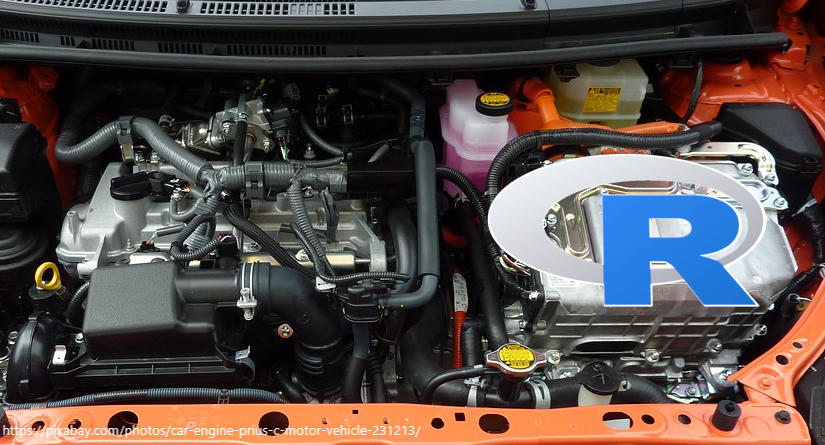{width="200"} {width="200"}

R und RStudio
:::

## RStudio einrichten

Öffnen Sie nach erfolgreicher Installation die Anwendung RStudio {width="20px"} und Sie sollten folgende Ansicht vor sich sehen:

```{r layout, echo = F, out.height="80%",out.width="80%", fig.align="center"}
# knitr::include_graphics(paste0(path1,"101_RStudio.png"))
```

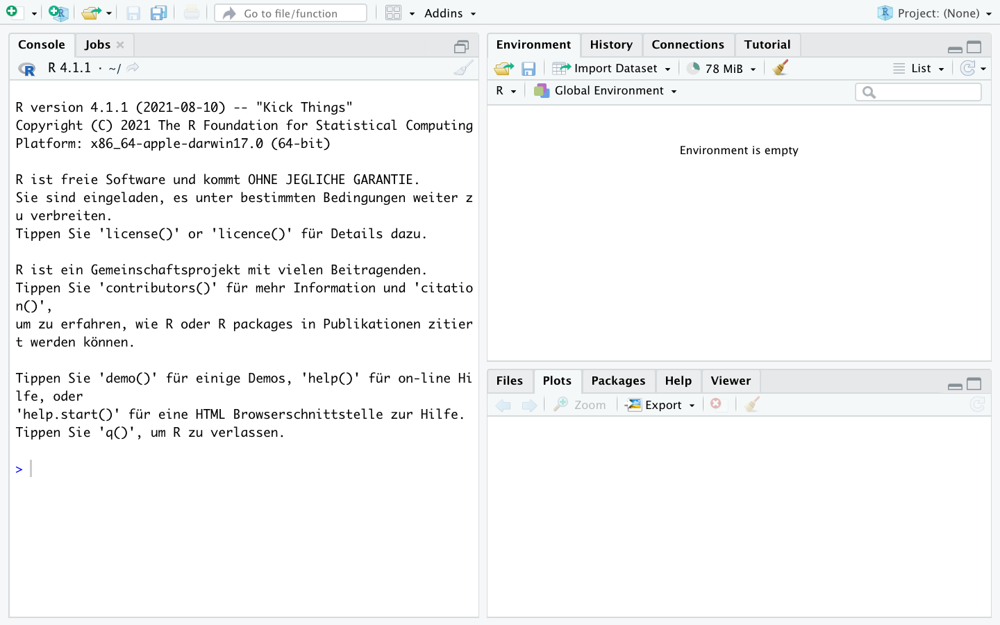

Um Probleme bei der künftigen Arbeit mit R zu vermeiden, deaktivieren Sie bitte das automatische Speichern und Laden des Workspace. Rufen Sie dazu das entsprechende Menü unter dem Reiter "Tools -\> Global options" auf und deaktivieren Sie bitte "Restore .RData into workspace at startup" und setzen Sie "Save workspace to .RData on exit:" auf `Never`. RStudio speichert ansonsten alle geladenen Objekte wenn Sie die Sitzung beenden und lädt diese automatisch wenn Sie das Programm das nächste Mal öffnen. Dies führt erfahrungsgemäß zu Problemen.

```{r workspace, echo = F, out.height="80%",out.width="80%", fig.align="center"}
# knitr::include_graphics(paste0(path1,"101_RStudio_setup.png"))
# file.copy(from = paste0(path1,"101_RStudio_setup.png"),to = paste0(path2,"101_RStudio_setup.png"))
```

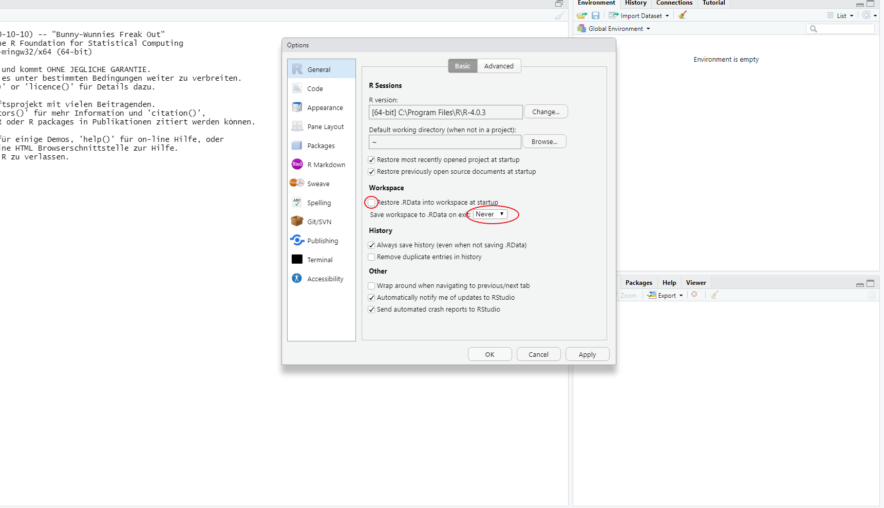

Bestätigen Sie die Einstellungen mit "Apply" und schließen Sie das Fenster mit "OK".

## Erste Schritte in R

Nach diesen grundlegenden Einstellungen können wir uns an die ersten Schritte in R machen. Öffnen Sie dazu zunächst ein Script, indem Sie auf das weiße Symbol links oben klicken oder drücken Sie gleichzeitig STRG/Command + Shift + N .

```{r script1, echo = F, out.height="40%",out.width="40%", fig.align="center"}
# knitr::include_graphics(paste0(path1,"101_RStudio_script2.png"))
```

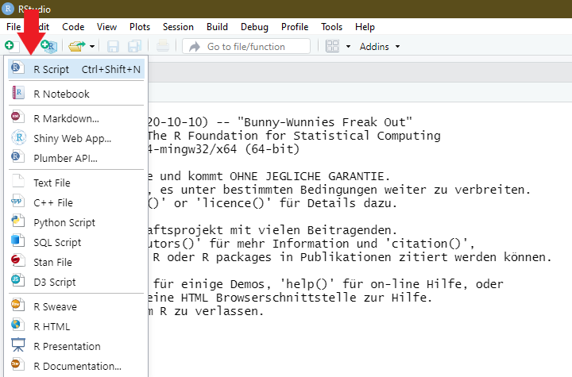{width="438"}

Es öffnet sich ein viertes Fenster, sodass Sie nun folgende Ansicht vor sich haben sollten:

```{r default_layout, echo = F, out.height="80%",out.width="80%", fig.align="center"}
# knitr::include_graphics(paste0(path1,"101_RStudio_script.png"))

```

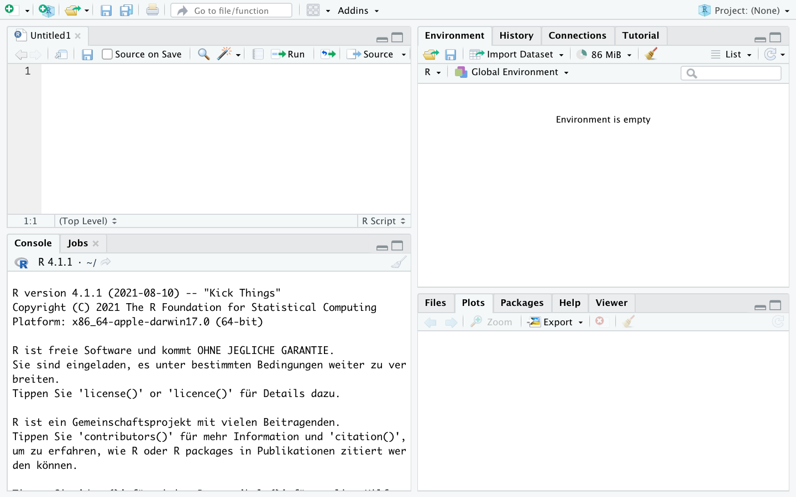

Dieser Scripteditor ist der Ort, an dem wir Befehle erstellen und anschließend durchführen werden. Der Scripteditor dient dabei als Sammlung aller durchzuführenden Befehle. Wir können diese Sammlungen speichern, um sie später wieder aufzurufen und vor allem können wir so Befehlssammlungen mit anderen teilen oder Skripte von anderen für uns selbst nutzen. Wir entwerfen also zunächst im Scripteditor eine Rechnung:

```{r script_entwurf, echo = F, out.height="40%",out.width="40%", fig.align="center"}
# knitr::include_graphics(paste0(path1,"101_RStudio_script0.png"))
```

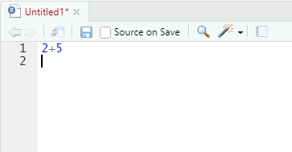{width="340"}

Um diese nun auszuführen, klicken wir in die auszuführende Zeile, sodass der Cursor in dieser Zeile ist und drücken gleichzeitig STRG und Enter (Mac-User Command und Enter):

```{r keyboard, echo = F, out.width="50%"}
# myimages <- c( paste0(path1,"101_keyboard_pc.png"), paste0(path1,"101_keyboard_mac.png") )
# knitr::include_graphics(myimages)
```

::: {#fig-keys layout-ncol="2"}
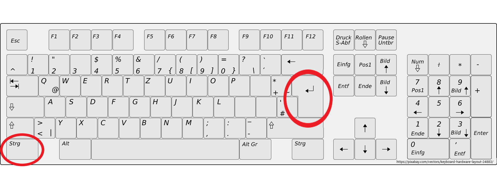{width="390"}

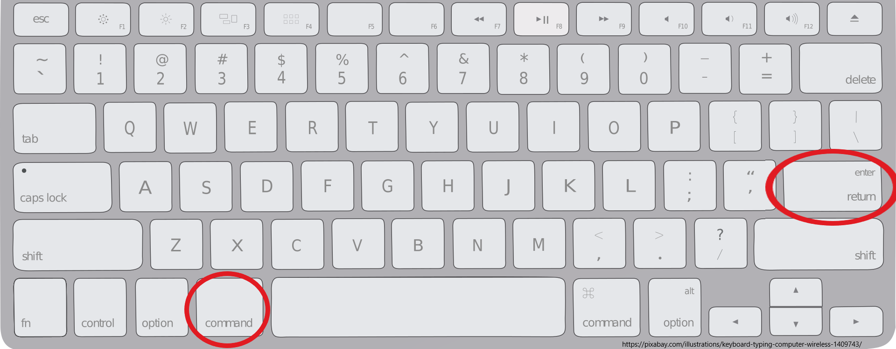{width="390"}

Shortcuts für Berechnungen
:::

R gibt die Ergebnisse unten in der Console aus:

```{r erste_rechnung,echo = F, out.height="35%",out.width="35%", fig.align="center"}
# knitr::include_graphics(paste0(path1,"101_RStudio_Erste_Rechnung.png"))
```

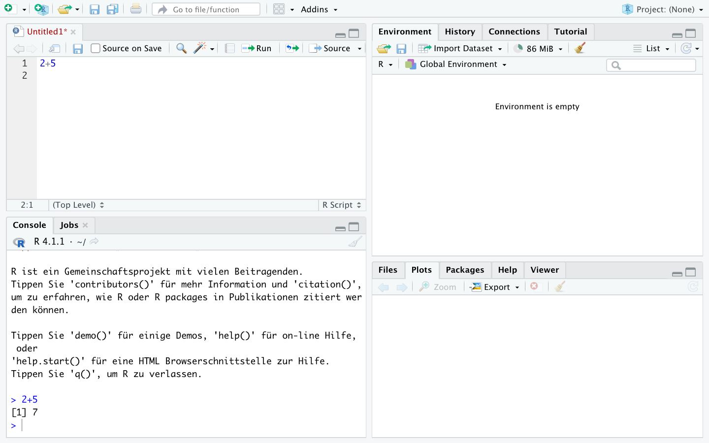

Das funktioniert auch für mehrere Rechnungen auf einmal indem wir mehrere Zeilen markieren und dann wieder STRG und Enter (Mac-User Command und Enter) drücken:

```{r zweite_rechnung,echo = F, out.height="65%",out.width="65%", fig.align="center"}
# knitr::include_graphics(paste0(path1,"101_RStudio_Rechnung.png"))
```

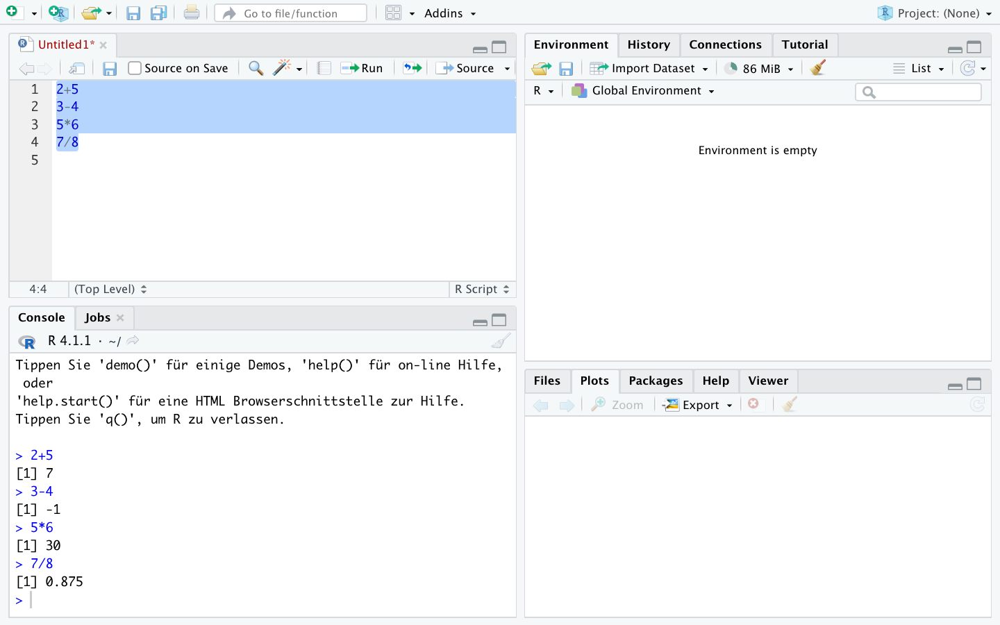

Eingaben aus dem Script-Editor und Ergebnisse aus der Konsole werden in Zukunft so dargestellt:

```{r W02_1, include=T, echo = T}
2+5
3-4
5*6
7/8
```

R beherrscht natürlich auch längere Berechnungen, zum Beispiel wird auch Punkt vor Strich beachtet:

```{r W02_2, include=T, echo = T}
2+3*2
(2+3)*2
```

Auch weitere Operationen sind möglich:

```{r W02_3, include=T, echo = T}
4^2 ## 4²
sqrt(4) ## Wurzel 
exp(1) ## Exponentialfunktion (Eulersche Zahl)
log(5) ## Natürlicher Logarithmus
log(exp(5)) ## log und exp heben sich gegenseitig auf
```

Ergebnisse lassen sich mit einem `<-` unter einem beliebigen Namen als Objekt speichern. Dann wird R uns nicht das Ergebnis anzeigen, sondern den Befehl in der Konsole wiederholen:

```{r W02_7, include=T, echo = T}
x <- 4/2
```

Im Fenster "Environment" rechts oben sehen wir jetzt das abgelegte Objekt `x`:

```{r enviro_bsp,echo = F, out.height="50%",out.width="50%", fig.align="center"}
# knitr::include_graphics(paste0(path1,"101_RStudio_Environment2.png"))
```

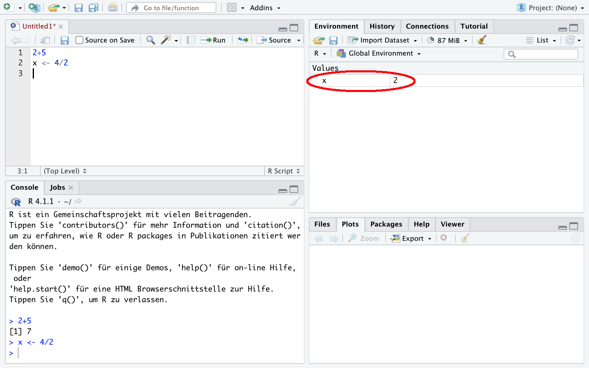

Wir können es später wieder aufrufen:

```{r W02_7.0}
x
```

Außerdem können wir Objekte in Rechnungen weiter verwenden - wir setzen einfach `x` ein und erstellen zB. `y`:

```{r W02_7.1, include=T, echo = T}
y <- x * 5
y
```

```{r enviro_bsp2,echo = F, out.height="45%",out.width="45%", fig.align="center"}
# knitr::include_graphics(paste0(path1,"101_RStudio_Environment.png"))
```

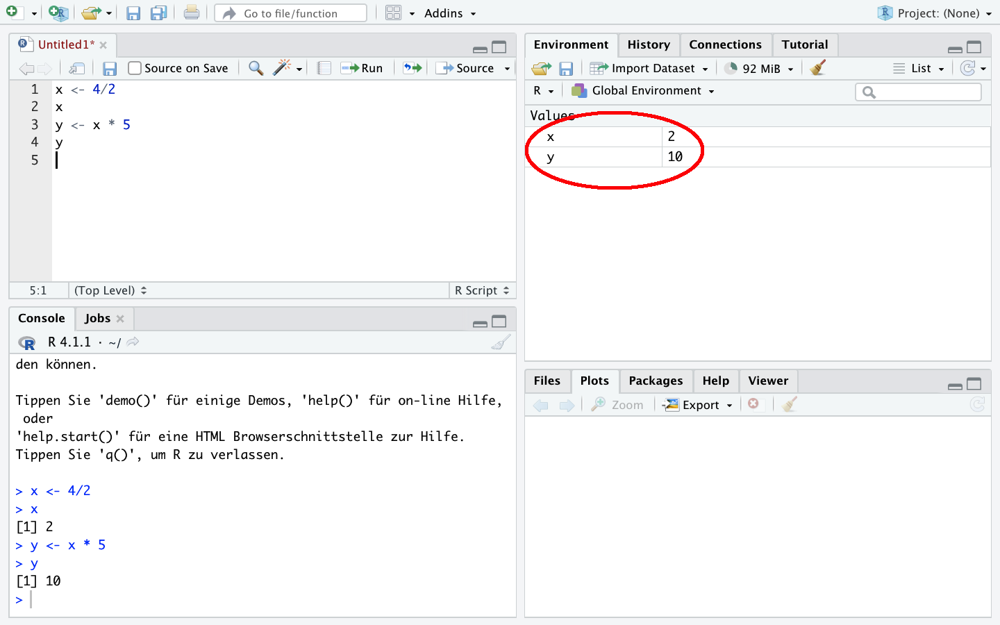

Mit `c()` lassen sich mehrere Werte unter einem Objekt ablegen und auch mit diesen lässt sich rechnen:

```{r W02_8, include=T, echo = T}
x1 <- c(1,2,3)
x1
x1* 2

y1 <- c(10,11,9)
y1
y1/x1
```

Natürlich können wir Objekte auch wieder löschen und zwar mit `rm()`. Wenn wir ein nicht existierendes Objekt aufrufen bekommen wir eine Fehlermeldung:

```{r error_test,error=TRUE}
rm(x1)
x1
```

Mit `rm(list = ls())` können alle Objekte aus dem Environment gelöscht werden.

Das Script können wir speichern, um es später wieder aufzurufen.

```{r save1,echo = F, out.height="80%",out.width="80%", fig.align="center"}
# knitr::include_graphics(paste0(path1,"101_RStudio_script3.png"))
```

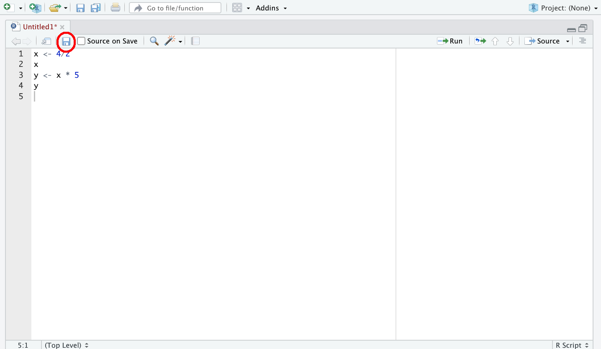{width="342"}

Wichtig ist dabei, der gespeicherten Datei die Endung ".R" zu geben, also zum Beispiel "R_Script1.R".

```{r save2,echo = F, out.height="50%",out.width="50%", fig.align="center"}
# knitr::include_graphics(paste0(path1,"101_RStudio_script4.png"))
```

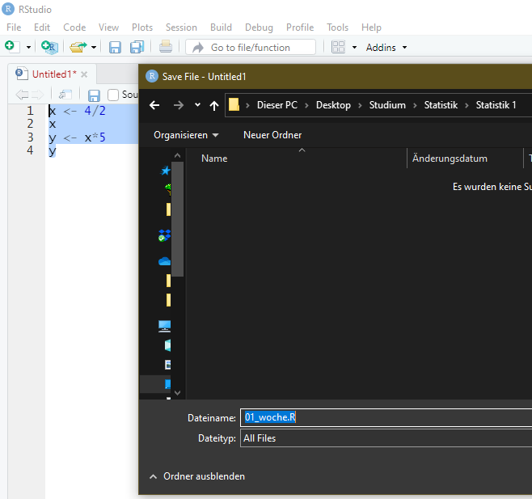{width="310"}

**Tipp:** Erstellen Sie sich am besten sofort einen Ordner, in dem Sie alle R Scripte und Datensätze[^intro-1] aus dieser Veranstaltung gesammelt ablegen.

[^intro-1]: Was das ist, werden wir in der kommenden Session lernen.

## Aufgaben

-   Berechnen Sie das aktuelle Alter einer Person, die im Jahr 1977 geboren wurde!

-   Legen Sie das Ergebnis unter `age` ab.

-   Wie können Sie `age` aufrufen, um zu sehen welcher Wert abgelegt wurde?

-   Legen Sie die Anzahl der Studierenden an der Uni Oldenburg (15643) unter `stud` ab.

-   Legen Sie die Anzahl der Professuren an der Uni Oldenburg (210) unter `prof` ab.

-   Berechnen Sie die Anzahl der Studierenden pro Professur an der Uni Oldenburg indem Sie die Objekte `stud` und `prof` verwenden.

-   Legen Sie das Ergebnis unter `studprof` ab und rufen Sie das das Objekt noch einmal auf!

-   Sehen Sie die erstellten Variablen im Environment-Fenster?

-   Löschen Sie das Objekt `stud`. Woran erkennen Sie, dass das funktioniert hat?

-   Legen Sie die Studierendenzahlen der Uni Bremen (19173), Uni Vechta (5333) und Uni Oldenburg (15643) zusammen unter `studs` ab.

-   Legen Sie die Zahl der Profs der Uni Bremen (322), Uni Vechta (67) und Uni Oldenburg (210) zusammen unter `profs` ab.

-   Berechnen die Anzahl der Studierenden pro Professur für alle drei Universitäten.

-   Sie möchten zusätzlich die Zahl der Studierenden (14000) und Professuren (217) der Uni Osnabrück in `studs` und `profs` ablegen. Wie gehen Sie vor?

-   Berechnen Sie für alle vier Universitäten das Verhältnis von Studierenden und Professuren!

-   Löschen Sie alle Objekte aus dem Environment.

In der ersten Session haben wir ein paar erste Schritte mit der Taschenrechnerfunktion in R unternommen. Die wirkliche Stärke von R ist aber die Verarbeitung von Daten - das lernen wir heute kennen.

Im vorherigen Kapitel haben wir die Studierendenzahlen der Uni Bremen (19173), Uni Vechta (5333) und Uni Oldenburg (15643) zusammen unter `studs` abgelegt und mit den in `profs` abgelegten Professurenzahlen ins Verhältnis gesetzt. Das funktioniert soweit gut, allerdings ist es übersichtlicher, zusammengehörige Werte auch zusammen ablegen. Dafür gibt es in R `data.frame`. Wir können dazu die beiden Objekte in einem Datensatz ablegen, indem wir sie in `data.frame` eintragen und das neue Objekt unter `df` ablegen. Wenn wir `df` aufrufen sehen wir, dass die Werte zeilenweise zusammengefügt wurden:

```{r , include=T, echo = T}
studs <- c(19173,5333,15643)    ## Studierendenzahlen unter "studs" ablegen 
profs       <- c(322,67,210)    ## Prof-Zahlen unter "profs" ablegen
df <- data.frame(studs, profs)
df    ## zeigt den kompletten Datensatz an
```

In der ersten Zeile stehen also die Werte der Uni Bremen, in der zweiten Zeile die Werte der Uni Vechta usw. Die Werte können wir dann mit `datensatzname$variablenname` aufrufen. So können wir die Spalte `profs` anzeigen lassen:

```{r , include=T, echo = T}
df$profs 
```

Mit `colnames()` können wir die Variablen-/Spaltennamen des Datensatzes anzeigen lassen, zudem können wir mit `nrow` und `ncol` die Zahl der Zeilen bzw. Spalten aufrufen:

```{r , include=T, echo = T}
colnames(df) ## Variablen-/Spaltennamen anzeigen
ncol(df) ## Anzahl der Spalten/Variablen
nrow(df) ## Anzahl der Zeilen/Fälle
```

Neue zusätzliche Variablen können durch `datensatzname$neuevariable` in den Datensatz eingefügt werden:

```{r , include=T, echo = T}
df$stu_prof <- df$studs/df$profs
## df hat also nun eine Spalte mehr:
ncol(df) 
df
```

## Variablentypen

Wir können auch ein oder mehrere Wörter in einer Variable ablegen, jedoch müssen Buchstaben/Wörter immer in `""` gesetzt werden.

```{r , include=T, echo = T}
df$uni <- c("Uni Bremen","Uni Vechta", "Uni Oldenburg")
df
```

Damit haben wir einen neuen Variablentypen kennen gelernt. Grundsätzlich gibt es in R zwei Variablentypen: numeric (enthält Zahlen) und character (enthält Text oder Zahlen, die als Text verstanden werden sollen). Darüber hinaus gibt es noch weitere Typen, die besprechen wir wenn sie nötig sind, zB. gibt es "integer" für numerische Variablen mit ausschließlich ganzzahligen Ausprägungen. Mit `class()` kann die Art der Variable untersucht werden oder mit `is.numeric()` bzw. `is.character()` können wir abfragen ob eine Variable diesem Typ entspricht:

```{r vecclass, include=T, echo = T}
class(df$profs)
class(df$uni)
is.numeric(df$profs)
is.numeric(df$uni)
is.character(df$profs)
```

Mit `as.character()` bzw. `as.numeric()` können wir einen Typenwechsel erzwingen:

```{r , include=T, echo = T,  error = TRUE}
as.character(df$profs) ## die "" zeigen an, dass die Variable als character definiert ist
```

Das ändert erstmal nichts an der Ausgangsvariable `df$profs`:

```{r}
class(df$profs)
```

Wir können diese Umwandlung auch permanent machen, indem wir `df$profs` mit der umgewandelten Variante überschreiben:

```{r , include=T, echo = T,  error = TRUE}
df$profs <- as.character(df$profs)
df$profs 
class(df$profs)
```

Mit `character`-Variablen kann nicht gerechnet werden, auch wenn sie Zahlen enthalten:

```{r , include=T, echo = T,  error = TRUE}
df$profs / 2 
```

Wir können aber natürlich `df$profs` spontan in `numeric` umwandeln, um mit den Zahlenwerten zu rechnen:

```{r , include=T, echo = T,  error = TRUE}
as.numeric(df$profs) / 2
```

Wenn wir Textvariablen in numerische Variablen umwandeln, bekommen wir `NA`s ausgegeben. `NA` steht in R für fehlende Werte:

```{r}
as.numeric(df$uni)
```

R weiß (verständlicherweise) also nicht, wie die Uni-Namen in Zahlen umgewandelt werden sollen.

## Zeilen oder Spalten auswählen

Wir können Einträge aus einem Datensatz mit \[ \] auswählen:

```{r , include=T, echo = T}
df[1,1] ## erste Zeile, erste Spalte
df[1,]  ## erste Zeile, alle Spalten
df[,1]  ## alle Zeilen, erste Spalte (entspricht hier df$studs)
df[,"studs"] ## alle Zeilen, Spalte mit Namen studs -> achtung: ""
```

Natürlich können wir auch mehrere Zeilen oder Spalten auswählen. Dafür müssen wir wieder auf `c( )` zurückgreifen:

```{r}
df[c(1,2),]  ## 1. & 2. Zeile, alle Spalten
df[,c(1,3)]  ## alle Zeilen, 1. & 3. Spalte (entspricht df$studs & df$stu_prof)
df[,c("studs","uni")] ## alle Zeilen, Spalten mit Namen studs und uni
```

## Zeilen auswählen mit Bedingungen

In diese eckigen Klammern können wir auch Bedingungen schreiben, um so Auswahlen aus `df` zu treffen.

```{r , include=T, echo = T}
df ## vollständiger Datensatz
df[df$uni == "Uni Oldenburg", ] ## Zeilen in denen uni gleich "Uni Oldenburg", alle Spalten
df[df$studs > 10000, ] ## Zeilen mit studs > 10000, alle Spalten
df[df$uni == "Uni Oldenburg" & df$studs > 10000, ] ## mehrere Bedingungen 
df[df$uni == "Uni Oldenburg" & df$studs < 10000, ] ## Kombination gibt es nicht
## Zeilen von uni auswählen:
df$uni[ df$studs < 10000 ]## wichtig: kein Komma!
```

Wir können die Ausgaben dann auch in einem neuen `data.frame`-Objekt ablegen:

```{r}
ueber_10tsd <- df[df$studs > 10000, ] 
ueber_10tsd
class(ueber_10tsd)
```

## Datensätze einlesen

In der Regel werden wir aber Datensätze verwenden, deren Werte bereits in einer Datei gespeichert sind und die wir lediglich einlesen müssen. Dafür gibt es unzählige Möglichkeiten. Wir werden hier vor allem den Import von csv-Dateien verwenden. csv [^intro-2] bezeichnet ein verbreitetes Dateiformat zur Speicherung oder zum Austausch einfach strukturierter Daten. Wesentlich für unsere Zwecke hier ist, dass in csv-Dateien die Spalten eines Datensatzes mit einem Trennzeichen gekennzeichnet sind. Verbreitete Trennzeichen sind Komma, Doppelpunkt oder Semikolon. Für alle weiteren Dateien, die wir im Lauf dieser Veranstaltung verwenden werden, ist das Semikolon als Trennzeichen gesetzt. Unser Datensatz `df` sieht im csv-Format so aus:

[^intro-2]: Abkürzung für comma-separated values

```{r,echo = F, out.height="50%",out.width="50%", fig.align="center"}
# knitr::include_graphics(paste0(path,"images/102_csvdatei.png"))
```


::: callout-warning
Nun wollen wir also eine csv-Datei einlesen, konkret eine reduzierte Version des bereits in der Vorlesung erwähnten Allbus-Datensatzes für das Jahr 2016.[^intro-3] Sie finden die csv-Datei "allbus2016_kompakt.csv" auf StudIP:
:::

[^intro-3]: Allbus steht für "Allgemeine Bevölkerungsumfrage der Sozialwissenschaften" und ist eine zweijährlich durchgeführte allgemeine Umfrage, welche repräsentative viele Aspekte der politischen und sozialen Einstellungen in Deutschland abfragt. Als Studierende können Sie sich sowohl den Allbus 2016 als auch die Ausgaben für weitere Jahre hier unkompliziert herunterladen: <https://www.gesis.org/allbus/download/download-querschnitte/>

Um den Datensatz nun in R zu importieren, sind zwei Schritte notwendig. Zuerst müssen wir R mitteilen unter welchem Dateipfad der Datensatz zu finden ist. Der Dateipfad ergibt sich aus der Ordnerstruktur Ihres Gerätes, so würde der Dateipfad im hier dargestellten Fall *"C:/Users/Andreas/Dokumente/Statistik/"* lauten:

```{r,echo = F, out.height="90%",out.width="90%", fig.align="center"}
# knitr::include_graphics(paste0(path,"images/102_dateipfad.png"))
```

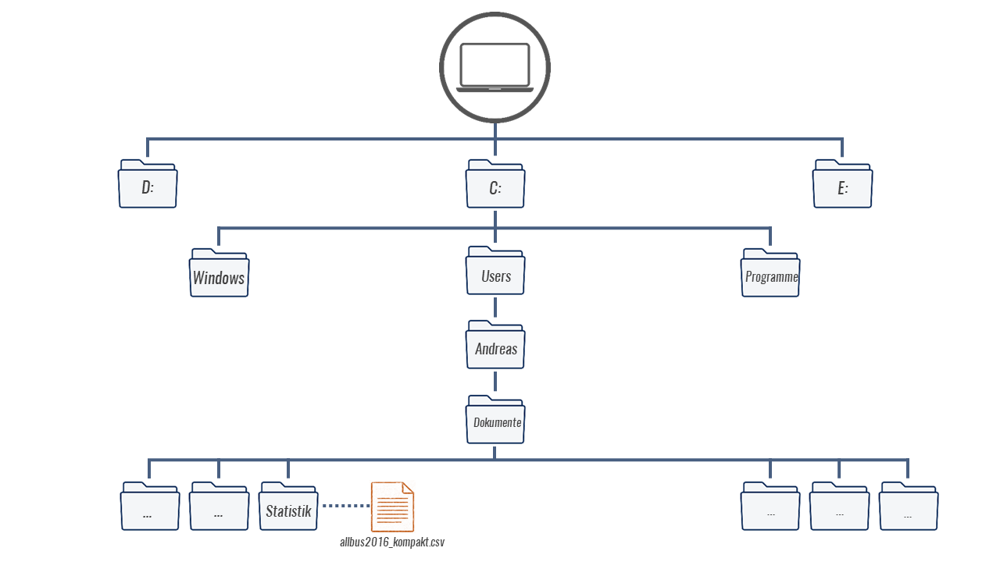

Natürlich hängt der Dateipfad aber ganz davon ab, wo Sie den Datensatz gespeichert haben. Um den Pfad des Ordners herauszufinden, klicken Sie bei Windows in die obere Adresszeile im Explorerfenster, bei Mac finden Sie den Pfad indem Sie einmal mit der rechten Maustaste auf die Datei und unter Informationen den Reiter "Ort" wählen.

```{r,echo = F, out.height="90%",out.width="90%", fig.align="center"}
# knitr::include_graphics(paste0(path,"images/102_Dateipfad_Win.png"))
```

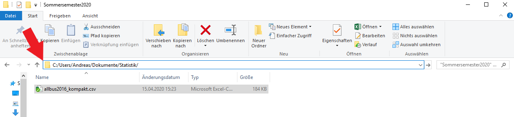

Diesen Dateipfad müssen wir also R mitteilen. Dafür gibt es mehrere Varianten, die einfachste ist `setwd()`. Wir setzen in die Klammern den Pfad des Ordners ein, in dem der Allbus-Datensatz gespeichert ist. Wichtig dabei ist dass Sie ggf. alle `\` durch `/`ersetzen müssen:

```{r, eval= F}
setwd("C:/Users/Andreas/Dokumente/Statistik/")
```

Mit `getwd()` lässt sich überprüfen, ob das funktioniert hat:

```{r, eval= F}
getwd()
```

Hier sollte der mit `setwd()` gesetzte Pfad erscheinen.

Ist das der Fall, können wir den eigentlichen Einlesebefehl `read.table` verwenden:

```{r,eval=F}
a16 <- read.table("allbus2016_kompakt.csv", sep = ";", header = T, stringsAsFactors = F)
```

```{r,echo=F}
a16 <- read.table(paste0(path,"allbus2016_kompakt.csv"), sep = ";", header = T, stringsAsFactors = F)
```

Der Einlesevorgang besteht aus zwei Teilen: zuerst geben wir mit `a16` den Namen an, unter dem R den Datensatz ablegt. Nach dem `<-` steht dann der eigentliche Befehl `read.table()`, der wiederum mehrere Optionen enthält. Als erstes geben wir den genauen Datensatznamen an - inklusive der Dateiendung. Darüber hinaus teilen wir R mit `sep` mit, dass ; als Trennzeichen gesetzt wurde und mit `header = T` teilen wir R zudem mit, dass die erste Zeile aus dem Datensatz als Spaltennamen verwendet werden soll. `stringsAsFactors = F` legt fest, dass Variablen mit Buchstaben (sog. strings) nicht in das Spezialformat `factor` überführt werden sollen (warum und was `factor`-Variablen sind, besprechen wir später).

Würden hier jetzt einfach `a16` eintippen bekämen wir den kompletten Datensatz angezeigt. Für einen Überblick können wir `head` verwenden:

```{r}
head(a16)
```

Mit `nrow` und `ncol` können wir kontrollieren, ob das geklappt hat. Der Datensatz sollte `r nrow(a16)` Zeilen und `r ncol(a16)` Spalten haben:

```{r}
nrow(a16)
ncol(a16)
```

Mit `View(a16)` öffnet sich zudem ein neues Fenster, in dem wir den gesamten Datensatz ansehen können.

Natürlich können wir wie oben auch aus diesem, viel größeren, Datensatz Zeilen und Spalten auswählen. Zum Beispiel können wir die Befragten auswählen, die älter als 87 Jahre alt sind und diese unter `senior` ablegen:

```{r}
senior <- a16[a16$age > 87,]
```

Möchten wir die genauen Altersangaben der Befragten aus `senior` sehen, können wir die entsprechende Spalte mit `senior$age` aufrufen:

```{r}
senior$age
```

Außerdem hat `senior` natürlich deutlich weniger Zeilen als `a16`:

```{r}
nrow(senior)
```

Wie wir beim Überblick gesehen haben, gibt es aber noch deutlich mehr Variablen im Allbus als `age` und nicht alle haben so aussagekräftige Namen - z.B. `gkpol`. Um diese Variablennamen und auch die Bedeutung der Ausprägungen zu verstehen brauchen wir das Codebuch. In ihm sind alle Variablennamen sowie die Ausprägungen erläutert. Laden Sie daher auch das Codebuch für den Allbus (Codebuch_allbus.pdf) herunter, wir werden es häufig brauchen!

```{r,echo = F, out.height="100%",out.width="100%", fig.align="center"}
# knitr::include_graphics("D:/oCloud/RFS/images/102_codebuch_comb.png")
```

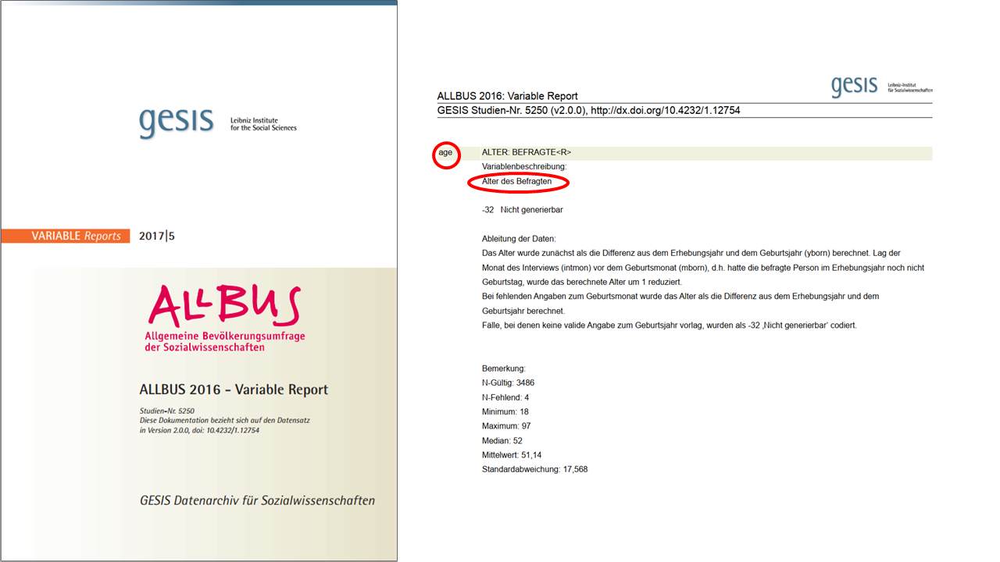

## Aufgaben

-   Sie finden in StudIP im Ordner Übungsunterlagen den Allbus 2016 unter dem Namen `allbus2016_kompakt.csv`. Laden Sie die Datei herunter und speichern Sie sie ab. Öffnen Sie die Datei bitte **nicht** direkt mit Excel, auch wenn Ihnen dies wahrscheinlich vorgeschlagen wird.

-   Laden Sie den Datensatz `allbus2016_kompakt.csv` in R und legen Sie den Datensatz unter `a16` ab.

-   Nutzen Sie `head()` und `View()`, um sich einen Überblick über den Datensatz zu verschaffen.

-   Wie viele Befagte (Zeilen) enthält der Datensatz?

-   Lassen Sie sich die Variablennamen von `a16` anzeigen!

-   Die Variable `sex` gibt das Geschlecht der Befragten an. Welcher Variablentyp ist für die Variable festgelegt, welches Skalenniveau hat die Variable?

-   Was verbirgt sich hinter der Variable `gkpol`? Sehen Sie im Codebuch nach! Welche Bedeutung hat die Ausprägung 2 für diese Variable?

-   Welches Skalenniveau hat `gkpol`?[^intro-4]

-   Welcher Variablentyp ist in R für `gkpol` festgelegt? Ändern Sie den Variablentyp.

-   Welche Information ist in der Variable `respid` abgelegt?

-   Wie können Sie sich die Zeile anzeigen lassen, welche den/die Befragte\*n mit der `respid` 3469 enthält?

-   Wie alt ist der/die Befragte mit der `respid` 3469? Welches Geschlecht hat die Person?

-   Erstellen Sie eine neue Variable mit dem Alter der Befragten im Jahr 2020!

-   Wählen Sie alle Befragten aus, die nach 1960 geboren wurden legen Sie diese Auswahl unter `nach_1960` ab.

-   Wie viele Spalten hat `nach_1960`? Wie viele Zeilen? Nutzen Sie für Ihre Antwort die Befehle die wir kennen gelernt haben.

[^intro-4]: Diese Frage ist eine inhaltliche, R hilft Ihnen hier nicht weiter.
