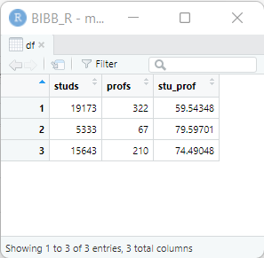
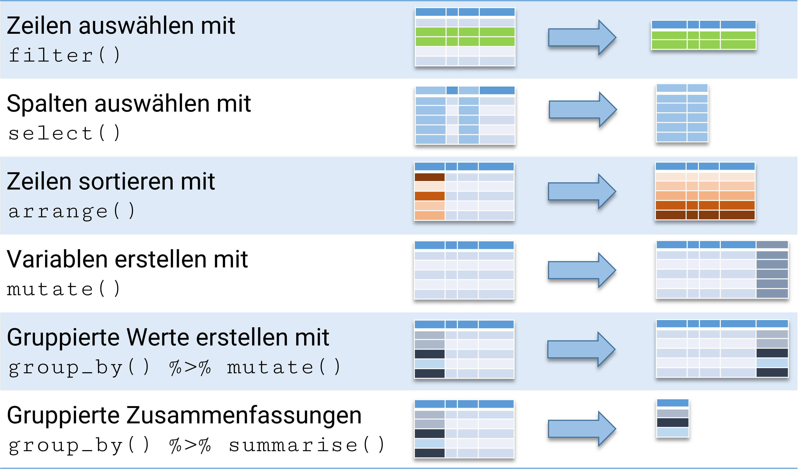
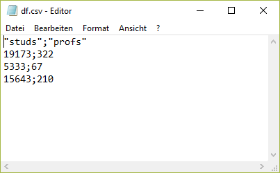
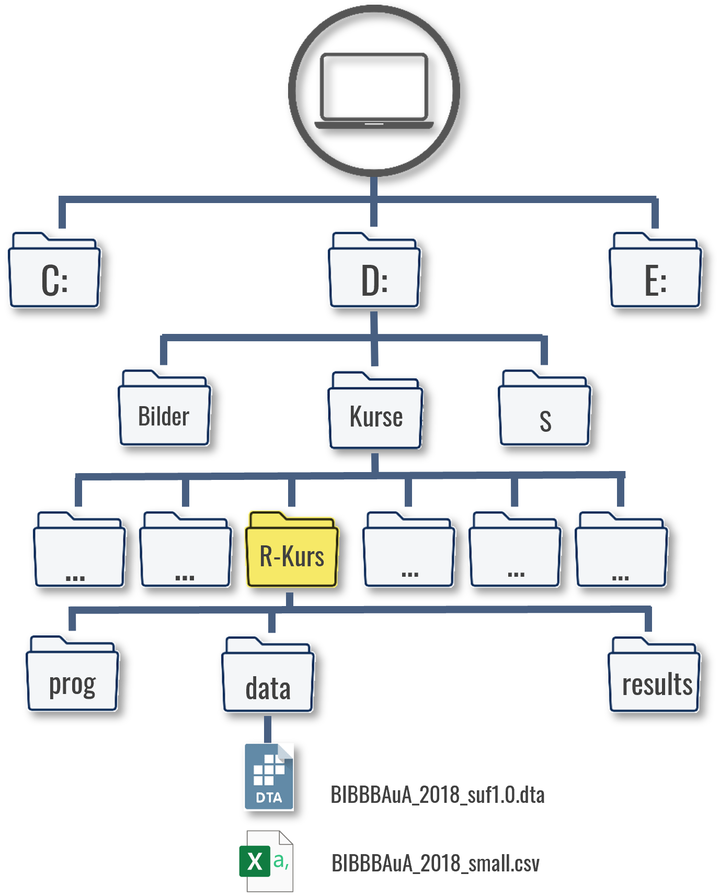
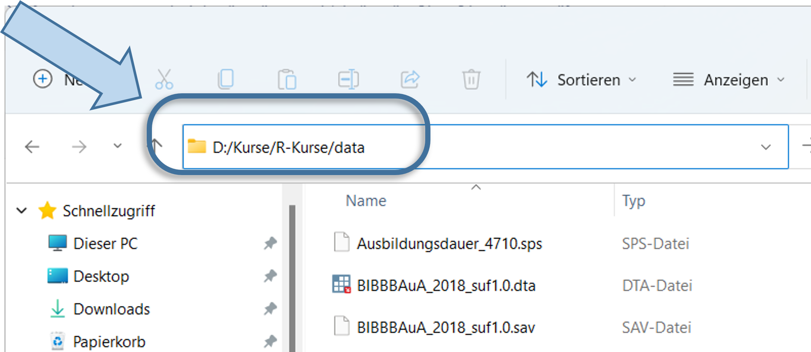
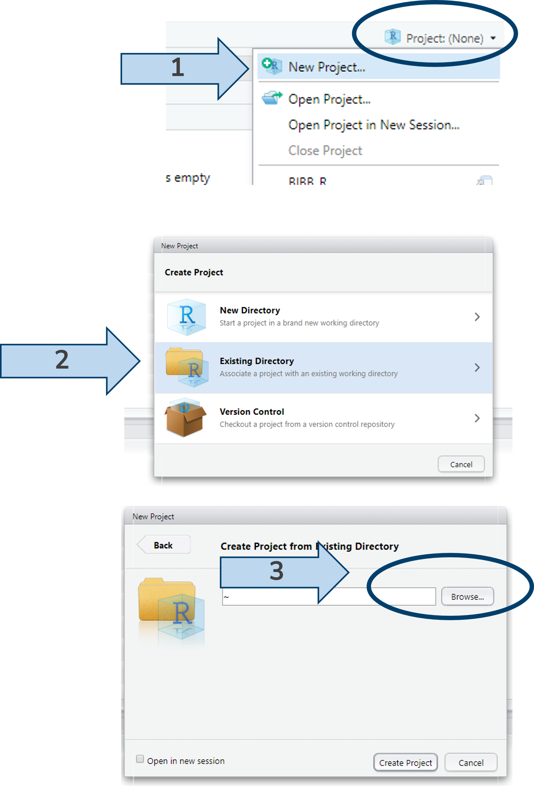
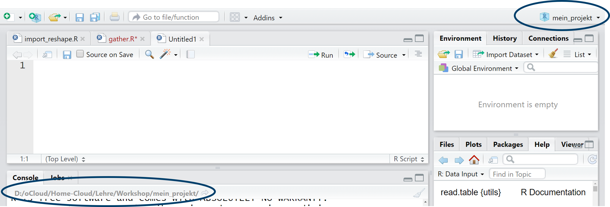
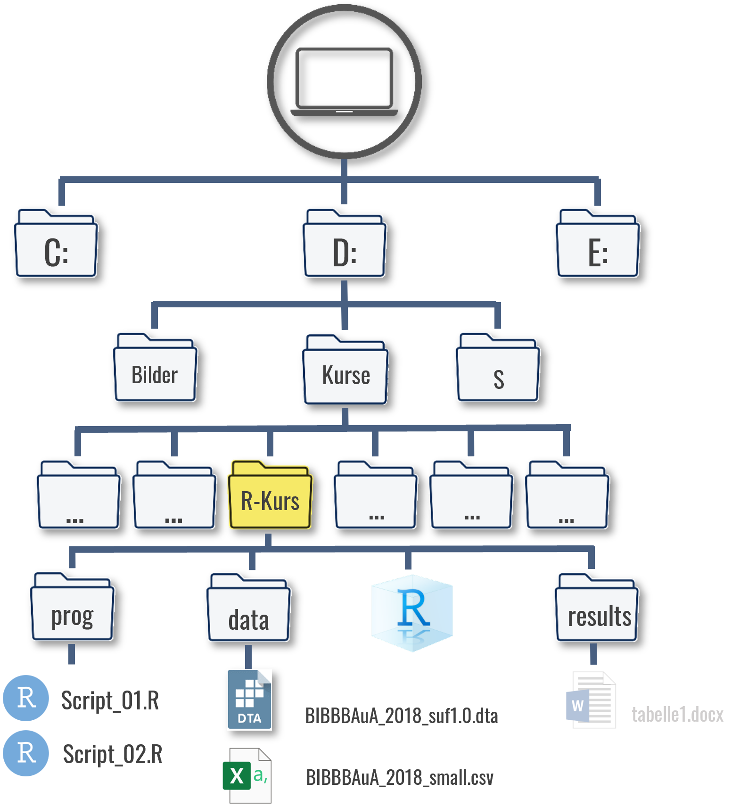

# Arbeiten mit Datensätzen in R

```{r setup02, include=F}
if(Sys.getenv("USERNAME") == "filse" ) .libPaths("D:/R-library4")
if(Sys.getenv("USERNAME") == "filse" ) path <- "D:/oCloud/RFS/"
library(tidyverse)
library(kableExtra)
```

In der ersten Session haben wir einige Schritte mit der Taschenrechnerfunktion in R unternommen. Die wirkliche Stärke von R ist aber die Verarbeitung von Daten - los gehts.

Im vorherigen Kapitel haben wir die Studierendenzahlen der Uni Bremen (19173), Uni Vechta (5333) und Uni Oldenburg (15643) zusammen unter `studs` abgelegt und mit den in `profs` abgelegten Professurenzahlen ins Verhältnis gesetzt. Das funktioniert soweit gut, allerdings ist es übersichtlicher, zusammengehörige Werte auch zusammen ablegen. Dafür gibt es in R `data.frame`. Wir können dazu die beiden Objekte in einem Datensatz ablegen, indem wir sie in `data.frame` eintragen und das neue Objekt unter `df` ablegen. Wenn wir `df` aufrufen sehen wir, dass die Werte zeilenweise zusammengefügt wurden:

```{r , include=T, echo = T}
studs <- c(19173,5333,15643)    # Studierendenzahlen unter "studs" ablegen 
profs       <- c(322,67,210)    # Prof-Zahlen unter "profs" ablegen
df_orig <- data.frame(studs, profs)
```

```{r , include=T, echo = T}
df <- data.frame(studs = c(19173,5333,15643), 
                 profs = c(322,67,210),
                 gegr  = c(1971,1830,1973)) # ohne zwischen-Objekte
df    # zeigt den kompletten Datensatz an
```

In der ersten Zeile stehen also die Werte der Uni Bremen, in der zweiten Zeile die Werte der Uni Vechta usw. Die Werte können wir dann mit `datensatzname$variablenname` aufrufen. So können wir die Spalte `profs` anzeigen lassen:

```{r , include=T, echo = T}
df$profs 
```

Mit `colnames()` können wir die Variablen-/Spaltennamen des Datensatzes anzeigen lassen, zudem können wir mit `nrow` und `ncol` die Zahl der Zeilen bzw. Spalten aufrufen:

```{r , include=T, echo = T}
colnames(df) ## Variablen-/Spaltennamen anzeigen
ncol(df) ## Anzahl der Spalten/Variablen
nrow(df) ## Anzahl der Zeilen/Fälle
```

Neue zusätzliche Variablen können durch `datensatzname$neuevariable` in den Datensatz eingefügt werden:

```{r , include=T, echo = T}
df$stu_prof <- df$studs/df$profs
## df hat also nun eine Spalte mehr:
ncol(df) 
df
```

Wir können auch ein oder mehrere Wörter in einer Variable ablegen, jedoch müssen Buchstaben/Wörter immer in `""` gesetzt werden.

```{r , include=T, echo = T}
df$uni <- c("Uni Bremen","Uni Vechta", "Uni Oldenburg")
df
```

Mit `View(df)` öffnet sich zudem ein neues Fenster, in dem wir den gesamten Datensatz ansehen können:

```{r, eval = F}
View(df)
```

```{r,echo = F, out.height="35%",out.width="45%", fig.align="center"}

```

## Variablentypen

Damit haben wir bisher zwei Variablentypen kennen gelernt: numeric (enthält Zahlen) und character (enthält Text oder Zahlen, die als Text verstanden werden sollen). Darüber hinaus gibt es noch weitere Typen, die besprechen wir wenn sie nötig sind, zB. gibt es factor-Variablen, die eine vorgegebene Sortierung und Werteuniversum umfassen oder logische Variablen. Vorerst fokussieren wir uns auf character und numeric Variablen. Mit `class()` kann die Art der Variable untersucht werden oder mit `is.numeric()` bzw. `is.character()` können wir abfragen ob eine Variable diesem Typ entspricht:

```{r vecclass, include=T, echo = T}
class(df$profs)
class(df$uni)
is.numeric(df$profs)
is.character(df$profs)
```

Mit `as.character()` bzw. `as.numeric()` können wir einen Typenwechsel erzwingen:

```{r , include=T, echo = T,  error = TRUE}
as.character(df$profs) ## die "" zeigen an, dass die Variable als character definiert ist
```

Das ändert erstmal nichts an der Ausgangsvariable `df$profs`:

```{r}
class(df$profs)
```

Wenn wir diese Umwandlung für `df$profs` behalten wollen, dann müssen wir die Variable überschreiben:

```{r , include=T, echo = T,  error = TRUE}
df$profs <- as.character(df$profs)
df$profs 
class(df$profs)
```

Mit `character`-Variablen kann nicht gerechnet werden, auch wenn sie Zahlen enthalten:

```{r , include=T, echo = T,  error = TRUE}
df$profs / 2 
```

Wir können aber natürlich `df$profs` spontan mit `as.numeric` umwandeln, um mit den Zahlenwerten zu rechnen:

```{r , include=T, echo = T,  error = TRUE}
as.numeric(df$profs)
as.numeric(df$profs) / 2
```

Wenn wir Textvariablen in numerische Variablen umwandeln, bekommen wir `NA`s ausgegeben. `NA` steht in R für fehlende Werte:

```{r}
as.numeric(df$uni)
```

R weiß (verständlicherweise) also nicht, wie die Uni-Namen in Zahlen umgewandelt werden sollen.

::: callout-tip
Nicht selten ist ein Problem bei einer Berechnung auf den falschen Variablentypen zurückzuführen.
:::

## Zeilen oder Spalten auswählen

Wir können Einträge aus einem Datensatz mit \[ \] auswählen:

```{r , include=T, echo = T}
df[1,1] # erste Zeile, erste Spalte
df[1,]  # erste Zeile, alle Spalten
df[,1]  # alle Zeilen, erste Spalte (entspricht hier df$studs)
df[,"studs"] # alle Zeilen, Spalte mit Namen studs -> achtung: ""
```

Natürlich können wir auch mehrere Zeilen oder Spalten auswählen. Dafür müssen wir wieder auf `c( )` zurückgreifen:

```{r, eval = F}
df[c(1,2),]  ## 1. & 2. Zeile, alle Spalten
df[,c(1,3)]  ## alle Zeilen, 1. & 3. Spalte (entspricht df$studs & df$stu_prof)
df[,c("studs","uni")] ## alle Zeilen, Spalten mit Namen studs und uni
```

In diese eckigen Klammern können wir auch Bedingungen schreiben, um so Auswahlen aus `df` zu treffen.

```{r , include=T, echo = T}
df # vollständiger Datensatz
df[df$uni == "Uni Oldenburg", ] # Zeilen in denen uni gleich "Uni Oldenburg", alle Spalten
df$studs[df$uni == "Uni Oldenburg" ] # Nur Studi-Zahl nachsehen: kein Komma 
```

Das funktioniert soweit wie gewünscht und wir können das Ganze jetzt erweitern:

```{r, eval=F}
df[df$uni == "Uni Oldenburg" & df$studs > 10000, ] # & bedeutet UND
```

Allerdings wird der Befehl hier schon sehr lang: wir müssen drei Mal `df` aufrufen und außerdem immer darauf achten, das Komma an der richtigen Stelle zu setzen. Eine kürzere und komfortablere Variante ist der Befehl `filter()` aus dem Paket `{dplyr}` [^04_intro-1]

```{r}
filter(df,uni == "Uni Oldenburg", studs > 1000)
```

[^04_intro-1]: Es hat sich in der R-Community etabliert, Pakete mit `{}` zu schreiben um sie deutlicher von Funktionen zu unterscheiden. Ich folge in diesem Skript dieser Konvention.

## Pakete in R {#packages}

Pakete sind Erweiterungen für R, die zusätzliche Funktionen beinhalten. <!-- Wir haben in diesem Kapitel schon einige Beispiele kennen gelernt: mit `{dplyr}` steht uns ein komfortablerer [`filter()`](#filter) zur Verfügung und Stata- oder SPSS-Dateien können wir mit Hilfe des Pakets `haven` einlesen und erstellen.  --> Pakete müssen einmalig installiert werden und dann vor der Verwendung in einer neuen Session (also nach jedem Neustart von R/RStudio) geladen werden. `install.packages()` leistet die Installation, mit `library()` werden die Pakete geladen:

```{r, eval=F}
install.packages("Paket") # auf eurem PC nur einmal nötig
library(Paket) # nach jedem Neustart nötig
```

Häufig werden bei `install.packages()` nicht nur das angegebene Paket, sondern auch eine Reihe weiterer Pakete heruntergeladen, die sog. "dependencies". Das sind Pakete, welche im Hintergrund verwendet werden, um die Funktionen des eigentlich gewünschten Pakets zu ermöglichen. Also nicht erschrecken, wenn die Installation etwas umfangreicher ausfällt.

Mit `install.packages()` schrauben wir sozusagen die Glühbirne in R, mit `library()` betätigen wir den Lichtschalter, sodass wir die Befehle aus dem Paket auch verwenden können. Mit jedem Neustart geht die Glühbirne wieder aus und wir müssen sie mit `library()` wieder aktivieren. Das hat aber den Vorteil, dass wir nicht alle Glühbirnen auf einmal anknipsen müssen, wenn wir R starten.

```{r,echo = F, out.height="53%",out.width="53%", fig.align="center"}

```

Wir werden in diesem Kurs vor allem mit Paketen aus dem [tidyverse](www.tidyverse.org/) arbeiten. tidyverse ist eine Sammlung an Paketen, die übergreifende Syntaxlogik haben und so besonders gut miteinander harmonisieren und eine riesige Bandbreite an Anwendungsfällen abdecken. Mit
```{r,eval =FALSE}
install.packages("tidyverse")
```
werden folgende Pakete installiert:

`r tidyverse::tidyverse_packages() %>% paste(.,collapse=", ")`

Wir werden einige im Laufe des Kurses kennen lernen. Das zunächst wichtigste ist `{dplyr}`, welches unter anderem die Auswahl von Fällen und Variablen erleichtert:

```{r dplyr, echo = F, out.height="80%",out.width="80%", fig.align="center"}
#| fig-cap: Darstellung nach [Andrew Heiss](https://talks.andrewheiss.com/2021-seacen/01_welcome-tidyverse/slides/01_tidyverse-dplyr.html#22) und dem [`{dplyr}` Cheatsheet](https://raw.githubusercontent.com/rstudio/cheatsheets/main/data-transformation.pdf) 

```

## Beobachtungen auswählen mit `filter()` {#filter}

Nachdem wir zunächst das Paket für `filter()` installiert haben (das ist `{dplyr}`) müssen wir das Paket noch mit `library()` laden:

```{r,eval = F}
install.packages("dplyr") # nur einmal nötig
```

```{r}
library(dplyr) # nach einmaligem install.packages("dplyr")
```

```{r}
filter(df,uni == "Uni Oldenburg", studs > 1000)
```

Die Auswahl ändert das Ausgangsobjekt `df` aber nicht:

```{r}
df
```

Möchten wir das Ergebnis unserer Auswahl mit `filter()` für weitere Schritte behalten, können wir unser Ergebnis in einem neuen `data.frame`-Objekt ablegen:

```{r}
ueber_10tsd <- filter(df, studs > 10000)
ueber_10tsd
class(ueber_10tsd)
```

In R stehen uns einige weitere Operatoren zur Auswahl von Zeilen zu Verfügung:

-   `<=` und `>=`: kleiner gleich/ größer gleich
-   `|` oder: `filter(df,studs > 10000 | prof < 200)`: mehr als 10.000 Studierende *oder* weniger als 200 Professuren
-   `%in%` "eines von": `filter(df, gegr %in% c(1971,1973,2004))`: gegründet 1971 oder 1973 oder 2004
-   `between()` ist eine Hilfsfunktion aus `{dplyr}` für Wertebereiche: `filter(df,between(studs,10000,20000)`: zwischen 10.000 und 20.000 Studierenden *oder* (jeweils eingeschlossen)

## Variablentypen II: logical

Diese Auswahl basiert auf einem dritten Variablentyp: 'logical', also logische Werte mit `TRUE` oder `FALSE`. Wenn wir mit `==`, `>` oder `<` eine Bedingung formulieren, dann erstellen wir eigentlich einen logischen Vektor in der selben Länge wie die Daten:

```{r}
df$studs > 10000 # ist die Studi-Zahl größer 10000?
df$more10k <-  df$studs > 10000 # ist die Studi-Zahl größer 10000?
```

```{r}
df
```

Wir könnten dann auch auf Basis dieser Variable filtern:

```{r}
filter(df,more10k)
```

## Variablen auswählen mit `select()` {#select}

Mit `select()` enthält `{dplyr}` auch einen Befehl zu Auswahl von Spalten/Variablen:

```{r}
df
select(df, studs,profs)
```

Wir können auch hier einige Operatoren verwenden: `:` um einen Bereich auszuwählen oder `!` als "nicht"-Operator:

```{r}
select(df, 1:3) # Spalte 1-3
select(df, !profs) # alles außer profs
```

`select()` hat außerdem einige Hilfsfunktionen, welche die Variablenauswahl auf Basis der Variablennamen einfacher machen.

-   `starts_with()`: Variablenname beginnt mit ..., bspw. `select(df,starts_with("p"))`
-   `ends_with()`: Variablenname endet mit ..., bspw. `select(df,ends_with("p"))`
-   `matches()`: Variablenauswahl mit einer [*regular expression*](https://jfjelstul.github.io/regular-expressions-tutorial/), bspw. `select(df,matches("_")`: alle Variablen mit `_` im Namen.
-   `num_range()`: Variablen mit Zahlenbereiche: `select(etb,num_range("F",1:220))`
-   `last_col()`: Letzte Variable, für die 4.letzte Variable bspw. `last_col(4)`
-   `any_of()` um eine Auswahl auf Basis eines `character`-Vektors zu treffen

Wenn wir beispielsweise die Spalten eines `data.frame`s auf Basis der `colnames` eines anderen `data.frame` Objekts auswählen möchten:

```{r}
col_auswahl <- colnames(df_orig)
col_auswahl
select(df, any_of(col_auswahl) )
```

Es gibt noch einige weitere Hilfsfunktionen, für eine vollständige Auflistung `?select_helpers`.

## [Übung](#data1) {#ue1}

## Datensätze einlesen

In der Regel werden wir aber Datensätze verwenden, deren Werte bereits in einer Datei gespeichert sind und die wir lediglich einlesen müssen. Dafür gibt es unzählige Möglichkeiten.

Wir werden hier vor allem den Import von csv-Dateien verwenden. csv [^02_intro-1] bezeichnet ein verbreitetes Dateiformat zur Speicherung oder zum Austausch einfach strukturierter Daten. Wesentlich für unsere Zwecke hier ist, dass in csv-Dateien die Spalten eines Datensatzes mit einem Trennzeichen gekennzeichnet sind. Verbreitete Trennzeichen sind Komma, Doppelpunkt oder Semikolon. Für alle weiteren Dateien, die wir im Lauf dieser Veranstaltung verwenden werden, ist das Semikolon als Trennzeichen gesetzt. Unser Datensatz `df` sieht im csv-Format so aus:

[^02_intro-1]: Abkürzung für comma-separated values

```{r,echo = F, out.height="50%",out.width="50%", fig.align="center"}
# knitr::include_graphics(paste0(path,"images/102_csvdatei.png"))
```



In diesem Seminar werden wir mit Daten aus BIBB/BAuA-Erwerbstätigenbefragung 2018 arbeiten. Die BIBB/BAuA ist eine Repräsentativbefragung von in Deutschland zu Arbeit und Beruf im Wandel und Erwerb und Verwertung beruflicher Qualifikation. Nun wollen wir also eine csv-Datei einlesen, zunächst eine reduzierte Version der ETB 2018.

Um den Datensatz nun in R zu importieren, müssen wir R mitteilen unter welchem Dateipfad der Datensatz zu finden ist. Der Dateipfad ergibt sich aus der Ordnerstruktur Ihres Gerätes, so würde der Dateipfad im hier dargestellten Fall "D:/Kurse/R-Kurse/" lauten:

Natürlich hängt der Dateipfad aber ganz davon ab, wo Sie den Datensatz gespeichert haben:

```{r,echo = F, out.height="45%",out.width="45%", fig.align="center"}

```

Um den Pfad des Ordners herauszufinden, klicken Sie bei Windows in die obere Adresszeile im Explorerfenster.

```{r,echo = F, out.height="40%",out.width="40%", fig.align="center"}

```

::: note
In iOS (Mac) finden Sie den Pfad, indem Sie einmal mit der rechten Maustaste auf die Datei klicken und dann die ALT-Taste gedrückt halten. Dann sollte die Option "...als Pfadname kopieren" erscheinen. [**Youtube Anleitung**](https://www.youtube.com/watch?v=zcb3D6Xdv4s)
:::

Diesen Dateipfad müssen wir also R mitteilen.

### Projekt einrichten {#rproj}

Grundsätzlich lohnt es sich, in RStudio Projekte einzurichten. Die Projekte setzen automatisch Arbeitsverzeichnis auf den Ort, an dem sie gespeichert sind. Das erleichtert das kollaborative Arbeiten: egal wer und auf welchem Gerät gerade an einem Projekt arbeitet - durch die Projektdatei sind alle Pfade immer relativ zum Projektverzeichnis. Im weiteren können auch Versionkontrolle via git, bspw. [github](www.github.com) und weitere Funktionen in der Projektdatei hinterlegt werden und so für alle Nutzenden gleich gesetzt werden. 
Außerdem bleiben die zuletzt geöffneten Scripte geöffnet, was ein Arbeiten an mehreren Projekten erleichtert.

```{r,echo = F, out.height="55%",out.width="65%", fig.align="center"}

```

Mit `getwd()` lässt sich überprüfen, ob das funktioniert hat:

```{r, eval= F}
getwd()
```

```{r, echo = F}
"D:/Kurse/R-Kurs"
```

```{r,echo = F, out.height="70%",out.width="75%", fig.align="center"}

```

Alternativ könnten wir auch mit folgendem Befehl ein .Rproj - Projekt erstellen:
```{r, eval = F, echo=T}
rstudioapi::initializeProject(path = "D:/Kurse/R-Kurs")
```


```{r,echo = F, out.height="55%",out.width="65%", fig.align="center"}
# 
```

### Der Einlesebefehl

Jetzt können wir den eigentlichen Einlesebefehl `read.table` verwenden. Für den Pfad können wir nach `file =` lediglich die Anführungszeichen angeben und innerhalb dieser die Tab-Taste drücken. Dann bekommen wir alle Unterverzeichnisse und Tabellen im Projektordner angezeigt.[^2]

[^2]: Manchmal kann der Datensatz aber nicht im Unterordner des Projekts liegen, dann kann natürlich auch der gesamte Pfad in `read.table()` angegeben werden: `etb <- read.table(file = "D:/Kurse/R-Kurs/data/BIBBBAuA_2018_small.csv", sep = ";", header = T)`

```{r}
etb <- read.table(file = "./data/BIBBBAuA_2018_small.csv", sep = ";", header = T)
```

Der Einlesevorgang besteht aus zwei Teilen: zuerst geben wir mit `etb` den Objektnamen an, unter dem R den Datensatz ablegt. Nach dem `<-` steht dann der eigentliche Befehl `read.table()`, der wiederum mehrere Optionen enthält. Als erstes geben wir den genauen Datensatznamen an - inklusive der Dateiendung. Darüber hinaus teilen wir R mit `sep` mit, dass ; als Trennzeichen gesetzt wurde und mit `header = T` (`T` steht für `TRUE`) teilen wir R zudem mit, dass die erste Zeile aus dem Datensatz als Spaltennamen verwendet werden soll.

::: important
Leider nutzen Windows-Systeme `\` in den Dateipfaden - das führt in R zu Problemen. Daher müssen Dateipfade immer mit `/` oder alternativ mit `\\` angegeben werden. RStudio kann zumindest etwas unterstützen, dem mit der *STRG + F* die Suchen & Ersetzen Funktion verwendet wird.
:::

Würden hier jetzt einfach `etb` eintippen bekämen wir den kompletten Datensatz angezeigt. Für einen Überblick können wir `head` verwenden:

```{r}
head(etb)
```

Mit `nrow` und `ncol` können wir kontrollieren, ob das geklappt hat. Der Datensatz sollte `r nrow(etb)` Zeilen und `r ncol(etb)` Spalten haben:

```{r}
nrow(etb)
ncol(etb)
```

Natürlich können wir wie oben auch aus diesem, viel größeren, Datensatz Zeilen und Spalten auswählen. Zum Beispiel können wir die Befragten auswählen, die vor 1940 geboren sind und diese unter `senior` ablegen:

```{r}
senior <- etb[etb$S2_j < 1940,]
```

Möchten wir die genauen Altersangaben der Befragten aus `senior` sehen, können wir die entsprechende Spalte mit `senior$age` aufrufen:

```{r}
senior$zpalter
```

Außerdem hat `senior` natürlich deutlich weniger Zeilen als `etb`:

```{r}
nrow(senior)
```

Wie wir beim Überblick gesehen haben, gibt es aber noch deutlich mehr Variablen in der ETB als `age` und nicht alle haben so aussagekräftige Namen - z.B. `gkpol`. Um diese Variablennamen und auch die Bedeutung der Ausprägungen zu verstehen brauchen wir das Codebuch. In ihm sind alle Variablennamen sowie die Ausprägungen erläutert. Laden Sie daher auch das Codebuch für den Allbus (Codebuch_allbus.pdf) herunter, wir werden es häufig brauchen!

```{r,echo = F, out.height="100%",out.width="100%", fig.align="center"}
# knitr::include_graphics("D:/oCloud/RFS/images/102_codebuch_comb.png")
```

### Überblick: Einlesen und Exportieren

::: panel-tabset
## Datensätze einlesen

```{r,echo=F,warning=F}
df_link2 <- 
  data.frame(cmd= c("read.table()","vroom()"),
             link = c("https://stat.ethz.ch/R-manual/R-devel/library/utils/html/read.table.html",
                      "https://www.tidyverse.org/blog/2020/01/vroom-1-1-0/"))
options(knitr.kable.NA = '')
readxl::read_xlsx(path = "02_readin.xlsx",sheet = 1) %>% 
  kbl(format = "html", booktabs = T,escape = F) %>% 
  kable_material(html_font = "Roboto") %>%
  kable_styling(bootstrap_options = c("striped", "hover", "condensed"), full_width = F, font_size = 12) %>% 
  column_spec(2:3,monospace = TRUE)
```

## Code

```{r, include=FALSE}
####| column: margin
```

```{r,eval =  F}
# csv Datei
df1 <- read.table(file = "Dateiname.csv",sep = ";")
# Rdata
df1 <- readRDS(file = "Dateiname.Rdata")
# große csv
library(vroom)
df1 <- vroom(file = "Dateiname.csv",delim = ";")
# Stata dta
df1 <- read_dta(file = "Dateiname.dta")
# SPSS sav
df1 <- read_sav(file = "Dateiname.sav")
# Excel
df1 <- read_xlsx(path = "Dateiname.xlsx", sheet = "1")
df1 <- read_xlsx(path = "Dateiname.xlsx", sheet = "Tabellenblatt1")
```
:::

::: panel-tabset
## Datensätze exportieren

```{r,echo=F,warning=F}
#### | column: margin
options(knitr.kable.NA = '')
# data.frame(Function = "`read_delim()`",
#            Formula = "$\\leftarrow$",
#            Break = "this continues on a new line",
#            Link = "[Google](www.google.com)") |>
#   kbl(format = "markdown") 

link_df <- 
  data.frame(link = c("https://www.geeksforgeeks.org/how-to-use-write-table-in-r/"))

readxl::read_xlsx(path = "02_readin.xlsx",sheet = 2) %>%
  kbl(format = "html", booktabs = T,escape = F) %>% 
  kable_material(html_font = "Roboto") %>%
  kable_styling(bootstrap_options = c("striped", "hover", "condensed"), full_width = F, font_size = 12) %>% 
  column_spec(2:3,monospace = TRUE)
```

## Code

```{r, eval = F,warning=F}
# csv
write.table(df,file = "Dateiname.csv",sep = ";",row.names = F)
# Rdata
saveRDS(df,file = "Dateiname.Rdata")
# dta
library(haven)
write_dta(df,path = "Dateiname.dta")
# sav
library(haven)
write_sav(df,path = "Dateiname.sav")
# xlsx
library(xlsx)
write.xlsx(df,file = "Dateiname.xlsx", sheetName = "Tabellenblatt 1")
```
:::

::: callout-note
Der Begriff *speichern* kann in R bisweilen zu Missverständnissen führen: Ist gemeint, einen Datensatz o.ä. (1) auf der Festplatte als .csv, .dta, .sav für andere Programme zugänglich abzulegen oder lediglich die Ergebnisse intern in R unter einem Objektnamen abzulegen? Ich vermeide daher das Wort speichern und spreche entweder von exportieren (im Fall 1 - in eine Datei schreiben) oder ablegen (Fall 2 - innerhalb von R in einem Objekt hinterlegen)
:::

## Befehlsstruktur

-   Funktionen sind (fast) immer Verben gefolgt von einer Klammer `()`, in welcher das zu bearbeitende Objekt sowie ggf. Optionen angegeben wird.
-   soll das Ergebnis einer Berechnung oder Operation nicht nur angezeigt sondern für weitere Schritte behalten werden, muss mit `name <- ...` das Ergebnis unter `name` abgelegt werden. Das Ausgangsobjekt bleibt unverändert.
-   Optionen innerhalb einer `()` können auch einfach auf Basis der Reihenfolge angegeben werden

## Übungen 1 {#data1}

-   Erstellen Sie den Datensatz mit den Studierenden- & Prof-Zahlen wie oben gezeigt:

```{r,eval= F}
df <- data.frame(studs = c(19173,5333,15643), 
                 profs = c(322,67,210),
                 gegr  = c(1971,1830,1973))
```

-   Sehen Sie den `df` in Ihrem Enviroment?
-   Lassen Sie sich nur die dritte Zeile von `df` anzeigen.
-   Lassen Sie sich nur die Spalte `gegr` anzeigen.
-   Installieren Sie die Pakete des tidyverse mit `install.packages("tidyverse")`
-   Nutzen Sie `filter`, um sich nur die Unis mit unter 10000 Studierenden anzeigen zu lassen. (Denken Sie daran, `{dplyr}` zu installieren und mit `library()` zu laden)

[Zurück](#ue1)

## Übungen 2 {#data2}

-   Erstellen Sie in Ihrem Verzeichnis für diesen Kurs ein [R-Projekt](#rproj)
-   Legen Sie die Erwerbstätigenbefragung in Ihrem Verzeichnis im Unterordner *data* ab.
-   Lesen Sie den Datensatz `BIBBBAuA_2018_small.csv` in R ein und legen Sie den Datensatz unter dem Objektnamen `etb` ab.
-   Nutzen Sie `head()` und `View()`, um sich einen Überblick über den Datensatz zu verschaffen.
-   Wie viele Befragte (Zeilen) enthält der Datensatz?
-   Lassen Sie sich die Variablennamen von `etb` anzeigen!
-   Die Variable `S1` gibt das Geschlecht der Befragten an. Welcher Variablentyp ist für die Variable festgelegt? Ändern Sie den Variablentyp auf `character`.
-   Wie können Sie sich die Zeile anzeigen lassen, welche den/die Befragte\*n mit der `intnr` 2781 enthält?
-   Wie alt ist der/die Befragte mit der `respid` 2781?
-   Erstellen Sie eine neue Variable mit dem Alter der Befragten im Jahr 2022! (Das Geburtsjahr ist in der Variable `S2_j` abgelegt.)
-   Wählen Sie alle Befragten aus, die nach 1960 geboren wurden legen Sie diese Auswahl unter `nach_1960` ab.
-   Wie viele Spalten hat `nach_1960`? Wie viele Zeilen? Nutzen Sie für Ihre Antwort die Befehle die wir kennen gelernt haben.

## Alternativen zu R-Projekten

Neben dem Einrichten eines Projekts können wir den Pfad auch mit `setwd()` setzen oder direkt in `read.table()` angeben. Das hat allerdings den Nachteil, dass diese Strategie nicht auf andere Rechner übertragbar ist: wenn jemand anderes die `.Rproj`-Datei öffnet, wird R automatisch die Pfade relativ zum Speicherort der Datei setzen. Das gilt auch wenn wir das Verzeichnis verschieben auf unserem Gerät - R wird automatisch das Arbeitsverzeichnis auf den neuen Speicherort setzen.

Zum Setzen des Arbeitsverzeichnis mit `setwd()` setzen wir in die Klammern den Pfad des Ordners ein. Wichtig dabei ist dass Sie ggf. alle `\` durch `/`ersetzen müssen:

```{r, eval= F}
setwd("D:/Kurse/R_BIBB")
```

Mit `getwd()` lässt sich überprüfen, ob das funktioniert hat:

```{r, eval= F}
getwd()
```

Hier sollte der mit `setwd()` gesetzte Pfad erscheinen.

Alternativ können wir auch in `read.table()` den vollen Pfad angeben:

```{r,eval= F}
etb <- read.table("C:/Kurse/R_BIBB/data/BIBBBAuA_2018_small.csv", sep = ";", header = T, stringsAsFactors = F)
```
