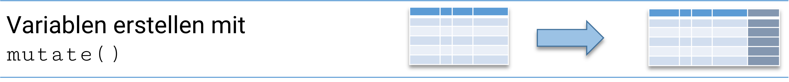

# Einen Überblick erhalten {#tab}

```{r setup03, echo = F, include=FALSE}
if(Sys.getenv("USERNAME") == "filse" ) .libPaths("D:/R-library4") 
if(Sys.getenv("USERNAME") == "filse" ) path <- "D:/oCloud/RFS/"
knitr::opts_chunk$set(collapse = F)
library(tidyverse)
 a14 <- readr::read_delim(paste0(path,"allbus_kumuliert.csv"), delim = ";", col_types = cols(.default = col_double())) %>% 
   filter(year == 2014) # für Gini Illustration
etb18 <- haven::read_dta("./data/BIBBBAuA_2018_suf1.0.dta")
library(Statamarkdown)
```

Nachdem wir Datensätze importiert haben, wollen wir nun einen Überblick erhalten. Jede statistische Auswertung startet mit einer Beschreibung der Variablen. In dieser Session werden wir sehen, wie wir uns mit Tabellen einen Überblick über die Informationen in einem Datensatz verschaffen können. Wir werden auch in dieser Session mit dem ETB2018 arbeiten. Wir starten also mit dem Einlesen der Daten:
```{r W04_1, eval=F, echo = T}
library(haven) # datenimport
library(tidyverse) # tidyverse
etb18 <- read_dta("./data/BIBBBAuA_2018_suf1.0.dta")
```

## Häufigkeitsauszählungen

Uns stehen (mindestens) drei Befehle zur Verfügung, um eine Häufigkeitsauszählung zu erstellen:

+ `table()`
+ `xtabs()`
+ `count()` aus `{dplyr}`


Einfachster Befehl für die Auszählung von Häufigkeiten ist der `table()` Befehl. Beispielsweise mit der Variable `m1202` zur Ausbildung der Befragten.
```{r W04_2, include=T, echo = T}
table(etb18$m1202)
```
Die Syntax für `xtabs()` ist etwas anders, aber hier bekommen wir die Variablennamen nochmal angezeigt - der wesentliche Output ist aber der gleiche:
```{r}
xtabs(~m1202,data=etb18)
```
Wir bekommen hier die absoluten Häufigkeiten angezeigt. In der ersten Zeile werden die verschiedenen Ausprägungen aufgelistet, in der zweiten Zeile stehen dann die Häufigkeiten. 

Allerdings werden sowohl für `table()` als auch `xabs()` die labels in der Ausgabe erstmal ignoriert. 
Mit `val_labels()` aus dem Paket `{labelled}` können wir die Labels aus dem Datensatz abrufen. - bspw. steht `1` dafür, dass der*die Befragte die keine Berufsabschluss besitzt:
```{r, eval=F}
#| code-fold: true
install.packages("labelled") # nur einmal nötig
library(labelled)
val_labels(etb18$m1202)
```

```{r}
#| echo: false
library(labelled)
val_labels(etb18$m1202)
```
```{r,echo=FALSE}
t2 <- xtabs(~m1202,data=etb18)
```

`r as.numeric(t2[2])` Befragte haben keinen Berufsabschluss, `r as.numeric(t2[4])` Befragte haben Aufstiegsfortbildung usw. (Zu labels und die Arbeit mit value labels in R später mehr)

Mit `count()` aus `{dplyr}` bekommen wir die labels direkt angezeigt, auch hier verwenden wir wieder die Schreibweise [mit der Pipe `%>%`](#pipe):
```{r}
etb18 %>% count(m1202)
```


Wir können auch Tabellen unter einem frei wählbaren Namen ablegen und später wieder aufrufen:
```{r W04_3, include=T, echo = T}
t1 <- xtabs(~m1202,etb18)
t2 <- etb18 %>% count(m1202)
```

Wir sehen hier, dass die Tabelle mit `xtabs()` eine neue Objektform ist, ein table. Mit `count()` wird hingegen ein `data.frame` erstellt.
```{r W04class, include=T, echo = T}
class(t1)
class(t2)
```

## Andere Tabellenwerte

Mit Hilfe weiterer Funktionen können wir die Häufigkeitstabellen jeweils anpassen:

+ `prop.table()`: relative Werte/Anteile

```{r W04_5, include=T, echo = T}
xtabs(~m1202,data=etb18) %>% prop.table(.) 
```
`r sprintf("%2.3f",prop.table(xtabs(~m1202,data=etb18)) [1]*100)`% aller Befragten haben keine Berufsausbildung.

+ `cumsum()`: kumulierte Werte

```{r W04_4, include=T, echo = T}
xtabs(~m1202,data=etb18) %>% cumsum(.)
```
```{r, echo = F}
ct2 <- xtabs(~m1202,data=etb18) %>% cumsum(.)
```

Also: `r ct2[2]` Befragte haben eine duale Berufsausbildung oder keine Berufsausbildung.


+ Kumulierte, relative Häufigkeiten

Auch die relativen Häufigkeiten können wir uns als kumulierte Werte ausgeben lassen, dazu kombinieren wir `prop.table()` mit `cumsum()`:
```{r}
xtabs(~m1202,data=etb18) %>% prop.table() %>% cumsum()
```
```{r,echo=FALSE}
t2x <- cumsum(prop.table(xtabs(~m1202,data=etb18)))
```


`r sprintf("%2.3f",round(t2x[2]*100,3))`% aller Befragten haben eine duale Berufsausbildung oder keine Berufsausbildung.

## Kontingenztabellen

Aus Kontingenztabellen erfahren wir, wie häufig Merkmalskombinationen auftreten. Auch für Kontingenztabellen können wir `table()` verwenden. Zum Beispiel können wir uns eine Tabelle anzeigen lassen, die uns die Häufigkeiten des Familienstatus getrennt nach Geschlechtern zeigt:
```{r, include=T, echo = T}
table(etb18$S1, etb18$m1202)
```
```{r, echo = T}
xtabs(~S1+m1202, data = etb18)
```

Wir erkennen aus dieser Tabelle beispielsweise, dass 4926 Befragte weiblich (`S1=2`) und ohne Berufsabschluss (`m1202 = 5`) sind.

Hier ist `xtabs()` informativer als `table()`. Hier werden die Spalten und Zeilen beschriftet. Der Übersichtlichkeit halber verwenden wir `xtabs()`, alle Operationen sind aber genauso auch mit `table()` möglich. 

## Zeilen- und Spaltenprozente

Auch für Kontingenztabellen können wir uns die relativen Häufigkeiten anzeigen lassen, indem wir `prop.table()` anwenden:
```{r, echo = T}
xtabs(~S1+m1202, data = etb18) %>% 
  prop.table(.) 
```
Die hier dargestellten relativen Häufigkeiten beziehen sich jeweils auf die Gesamtzahl der Befragten. Formal dargestellt wird also für die Kombination weiblich (`S1=2`) und Aufstiegsfortbildung (`m1202 = 5`) die Anzahl ledigen Frauen durch die Anzahl **aller Befragten** geteilt: $\frac{\text{Anzahl Frauen mit Aufstiegsfortbildung }}{\text{Gesamtzahl der Befragten}} \Rightarrow$ 3,27% *aller Befragten* sind Frauen mit Aufstiegsfortbildung. 

Wir können diese Tabelle auch mit *Zeilen- und Spaltenprozenten* anzeigen lassen, indem wir die Option `margin` verwenden. `margin=1` liefert die **Zeilenprozente**, `margin=2` die **Spaltenprozente**.[^1]  

[^1]: Der Übersichtlichkeit halber wurden die Darstellungen hier gerundet - siehe [Hinweise](#hinweise_w04).
```{r, eval = F}
xtabs(~S1+m1202, data = etb18) %>% 
  prop.table(.,margin = 1)
```
```{r, echo = F}
xtabs(~S1+m1202, data = etb18) %>% 
  prop.table(.,margin = 1) %>% 
  round(., 4)
```
```{r, eval = F}
xtabs(~S1+m1202, data = etb18) %>% 
  prop.table(.,margin = 2)
```
```{r, echo = F}
xtabs(~S1+m1202, data = etb18) %>% 
  prop.table(.,margin = 2) %>% 
  round(., 4)

pct_spl <- 
  xtabs(~S1+m1202, data = etb18) %>% 
  prop.table(.,margin = 2) %>% 
  round(., 4)
```

+ Für die Zeilenprozente werden die Werte in Bezug zu den Zeilensummen gesetzt. Also wird die Anzahl der Frauen mit Aufstiegsfortbildung ins Verhältnis zur Zahl der befragten Frauen gesetzt: $\frac{\text{Anzahl Frauen mit Aufstiegsfortbildung}}{\text{Gesamtzahl der befragten Frauen}}\Rightarrow$  6,56% der befragten Frauen haben eine Aufstiegsfortbildung

+ Für die Spaltenprozente werden die Werte in Bezug zu den Spaltensummen gesetzt. Also wird die Anzahl der Frauen mit Aufstiegsfortbildung ins Verhältnis zur Zahl aller Befragten mit Aufstiegsfortbildung gesetzt: $\frac{\text{Anzahl Frauen mit Aufstiegsfortbildung}}{\text{Gesamtzahl der Befragten mit Aufstiegsfortbildung}}\Rightarrow$ 37,8% der Befragten mit Aufstiegsfortbildung sind Frauen


### [Übung](#ue1)

## Fehlende Werte in R: `NA` {#NA03}

Um die Werte mit `-1` auch in R als fehlende Angabe zu kennzeichnen, müssen wir sie in `etb18` auf `NA` setzen. Dazu rufen wir `etb18$m1202` auf und filtern mit `[]` nur die Werte für `m1202` gleich `-1` heraus. Im vorherigen Kapitel haben wir kennengelernt, dass wir so spezifische Werte aufrufen können:
```{r}
#| eval: false
etb18$m1202[etb18$m1202 == -1] # nur m1202 = -1 aufrufen
```
(Hier bekommen wir nochmal die Labels ausgespuckt, was etwas suboptimal für die Übersichtlichkeit ist.)

Wenn wir daran mit `<-` einen neuen Wert angeben, werden die aufgerufenen Werte damit überschrieben - hier überschreiben wir also alle Werte für `m1202 == -1` mit `NA`: 
```{r W04_3miss, include=T, echo = T}
etb18$m1202[etb18$m1202 == -1]  <- NA
```

`NA` ist in der R der Code für fehlende Angaben, sie werden dann in `xtabs()` nicht aufgeführt:
```{r W04_3miss_tab, include=T, echo = T}
xtabs(~m1202,data=etb18)
```
Wir können aber mit der Option `addNA = TRUE` die Auszählung von `NA` explizit anfordern:
```{r}
xtabs(~m1202,data=etb18,addNA = T)
```

In `count()` wird `NA` auch mit ausgezählt:
```{r}
etb18 %>% count(m1202)
```
Möchten wir das umgehen, nehmen wir wieder `filter()` zu Hilfe - mit `is.na()` können wir `NA` identifizieren. Durch Voranstellen von `!` können wir damit anfordern, dass alle nicht-`NA`-Werte mit `TRUE` behalten werden:
```{r}
etb18 %>% filter(!is.na(m1202)) %>% count(m1202)
```

```{r}
etb18 %>% filter(!is.na(m1202)) %>% count(S1,m1202)
```

Mehr zu fehlenden Werten findet sich beispielsweise im [**The missing book**](https://tmb.njtierney.com/) von Nicholas Tierney & Allison Horst.

### [Übung](#ue2)


## Mehrere Kennzahlen in einer Tabelle

Aus Stata kennen viele sicherlich folgende Ansicht mit `tab m1202`:
```{stata miss5b, echo = F, collectcode=F}
set linesize 80
qui use "D:\Datenspeicher\BIBB_BAuA/BIBBBAuA_2018_suf1.0.dta", clear
qui mvdecode m1202 F100_kldb2010_BOF F1609_kldb2010_BOF F1610_kldb2010_BOF, mv(-1)
qui mvdecode F100_wib1, mv(-4/-1)
tab m1202
```
In R hat ein `table()` oder `xtabs()` immer nur eine Art von Kennzahlen. 
Da wir aber mit `count()` die Auszählungen als `data.frame()` erhalten, können wir die relativen und kumulierten Häufigkeiten einfach als neue Variablen anfügen. Dabei hilft uns `mutate()`: mit `mutate(neu_variable = )` können wir neue Variablen in einen `data.frame()` hinzufügen:
```{r, echo = F, out.height="90%",out.width="90%", fig.align="center"}
#| echo: false


```

`mutate()` entspricht also `dat1$var <- ....`, das wir im vorherigen Kapitel kennen gelernt hatten. Allerdings können wir mit `mutate()` einfacher in einer Pipe-Kette arbeiten (und außerdem einige weitere Operationen einfacher erledigen - dazu später mehr).

Um also eine neue Spalte `pct`in unseren `data.frame` mit den Auszählungen einzufügen gehen wir wie folgt vor:

```{r W201_9_pipe, echo = T}
etb18 %>% 
   count(m1202) # ausgangsbefehl

etb18 %>% 
   count(m1202) %>% 
   mutate(pct= prop.table(n)*100) # erweitert um pct
```

```{r}
etb18 %>% 
   count(m1202) %>% 
   mutate(pct= prop.table(n)*100,
          Cum = cumsum(pct)) 
```

Der Punkt `.` steht jeweils für das Ergebnis des vorherigen Schritts. Hier also:

   1. Erstelle die Häufigkeitstablle für `m1202` *und dann (`%>%`)*
   2. Berechne aus `n` die relativen Häufigkeiten *und dann (`%>%`)*
   3. Berechne dafür die kumulierten Werte basierend auf `pct` *und dann (`%>%`)*
   4. Runde das Ergebnis auf 3 Nachkommastellen

Etwas störend ist aber noch die `-1`, die für fehlende Angaben steht und nicht berücksichtigt werden soll.
Wir werden gleich noch mehr zu fehlenden Werten in R erfahren, aber eine schnelle Lösung ist einfach `-1` mit `filter()` auszuschließen:
```{r}
etb18 %>% 
  filter(m1202 != -1) %>% 
   count(m1202) %>% 
   mutate(pct= prop.table(n)*100,
          Cum = cumsum(pct)) 
```

## Kontingenztabellen mit `count()`

```{r}
etb18 %>% 
  filter(m1202 != -1) %>% 
   count(m1202,S1)
```

```{r}
etb18 %>% 
  filter(m1202 != -1) %>% 
   count(m1202,S1) %>% 
   mutate(pct = prop.table(n)) %>% 
   group_by(S1) %>% 
   mutate(pct_gender = prop.table(n)) 
```

### [Übung](#ue3)

##  Lage- & Konzentrationsmaße 

```{r, echo =F}
etb18$F518_SUF <- as.numeric(etb18$F518_SUF)
```

Lagemaße sind statische Kennzahlen zur Beschreibung von metrischen Variablen, wie beispielsweise das . Einen Überblick bietet `summary()`:
```{r sw5_quant_summary}
summary(etb18$F518_SUF)
```

Allerdings gibt es im Datensatz keine Befragten mit einem Bruttoverdienst von 99999 EUR. 
99999 ist der Zahlencode *keine Angabe* , 99998 für *weiß nicht*. Um aussagekräftige Werte zu bekommen, müssen wir diese Werte mit `NA` überschreiben:
```{r sw5_2, include=T, echo = T, fig.align='center', fig.height=  3.5, fig.width= 3.5}
etb18$F518_SUF[etb18$F518_SUF %in% 99998:99999] <- NA # missings überschreiben
```

```{r sw5_quant_summary2}
summary(etb18$F518_SUF)
```


Wir können aber auch bestimmte Kennzahlen anfordern sehen uns die Bruttoverdienste der Befragten zu beschreiben:

+ Minimum und Maximum: `min()`, `max()`
+ arithm. Mittel: `mean()`
+ Median: `median()`
+ Quantile: `quantile()`
+ Varianz: `var()`
+ Standardabweichung: `sd()`
+ Gini-Koeffizient: `Gini` aus dem Paket `{ineq}`


Wenn eine Variable `NA` enthält, müssen diese explizit ignoriert werden - ansonsten wird nur `NA` ausgegeben:
```{r sw5_3, include=T, echo = T, fig.align='center', fig.height=  3.5, fig.width= 3.5}
min(etb18$F518_SUF)
```
Deshalb müssen wir die Option `na.rm = T` angeben:
```{r sw5_3b, include=T, echo = T, fig.align='center', fig.height=  3.5, fig.width= 3.5}
min(etb18$F518_SUF,na.rm = T)
```

Ein Quantil einer Verteilung trennt die Daten so in zwei Teile, dass `x`\% der Daten darunter und 100-`x`\% darüber liegen.  Gebräuchlich sind die Quartile, welche die Grenzen für 25\%, 50\% und 75\% angeben. Diese werden auch standardmäßig von `quantile()` ausgegeben:
```{r sw5_quant1}
quantile(etb18$F518_SUF,na.rm = T)
```
Wir können aber durch Angabe in den Optionen beliebige Quantilgrenzen anfordern, zB. für die 40%-Quantilgrenze:  
```{r sw5_quant2}
quantile(etb18$F518_SUF,probs = .4, na.rm = T)
```
In Kombination mit `seq()` können wir zB. auch die Dezilgrenzen (entlang der Vielfachen von 0,1) anfordern:
```{r sw5_quant3}
quantile(etb18$F518_SUF,probs = c(0,0.1,0.2,0.3,0.4,0.5,0.6,0.7,0.8,0.9,1), na.rm = T) 
quantile(etb18$F518_SUF,probs = seq(0,1,0.1), na.rm = T) 
```

Wir können die Varianz mit `var()` berechnen:
```{r W07_6, include=T, echo = T}
var(etb18$F518_SUF, na.rm = T) # Varianz
```
Die Standardabweichung erhalten wir mit `sd()`:
```{r}
sd(etb18$F518_SUF, na.rm = T) # Standardabweichung
```

Den [Gini-Koeffizienten](#gini_graph) können wir mit `Gini()` aus dem Paket `ineq` berechnen:
```{r,eval=F}
install.packages("ineq") # einmal installieren
```

```{r, echo=F}
library(ineq) # ineq laden
Gini(etb18$F518_SUF)
```

### Lage- und Streuungsmaße vergleichen
Häufig werden diese Kennzahlen erst im Vergleich richtig spannend, dafür hilft uns das `group_by()` Argument und `summarise()`:
```{r, echo=F}
nrw_nds <- mean(etb18$F518_SUF[etb18$Bula == 5], na.rm = T) -
  mean(etb18$F518_SUF[etb18$Bula == 3], na.rm = T) # Niedersachsen
```


```{r}
etb18 %>% 
  group_by(Bula) %>% 
  summarise(mean_inc = mean(F518_SUF, na.rm = T) )
etb18 %>% 
  group_by(Bula) %>% 
  summarise(mean_inc = mean(F518_SUF, na.rm = T),
            median_inc = median(F518_SUF, na.rm = T))

etb18 %>% 
  filter(Bula %in% c(3,5)) %>% 
  group_by(Bula) %>% 
  summarise(mean_inc = mean(F518_SUF, na.rm = T) )
```


::: callout-tip

Für den Kennzahlenvergleich können wir auch die Schreibweise mit `[]` verwenden, beispielsweise können wir für das gesamte `summary` die Differenz zwischen NRW und Niedersachsen bilden:
```{r sw5_su_vgl}
summary(etb18$F518_SUF[etb18$Bula == 5], na.rm = T) -
  summary(etb18$F518_SUF[etb18$Bula == 3], na.rm = T) 
```

:::

::: note

[**Häufige Fehlermeldungen**](#rerror)

:::

## Übungen




## Hinweise 

### Runden mit `round()` {#round}


Erläuterung: Sie können mit `round(x , 3)` Werte auf eine gewisse Zahl von Ziffern runden. Die zweite Zahl in der Klammer (nach dem Komma) gibt an, wieviele Dezimalstellen wir möchten:
```{r W04_9, include=T, echo = T}
round(21.12121123,digits = 3)
round(21.12121123,digits = 5)
round(21.12121123,digits = 0)
```

Wir können also die relativen Häufigkeiten runden und so die Tabelle von oben übersichtlicher machen: 
```{r W04_11, eval=F, echo = T}
xtabs(~S1+m1202, data = etb18) %>% 
  prop.table(.,margin = 1) %>% 
  round(.,3)
```


### Wie kann ich mir in R automatisch die häufigste/seltenste Ausprägung ausgeben lassen?

```{r}
t4 <- table(etb18$zpalter)
t4[which(t4 == max(t4))] # Modus
```
`r names(t4[which(t4 == max(t4))])` ist mit `r t4[which(t4 == max(t4))]` Befragten die häufigste Ausprägung.





