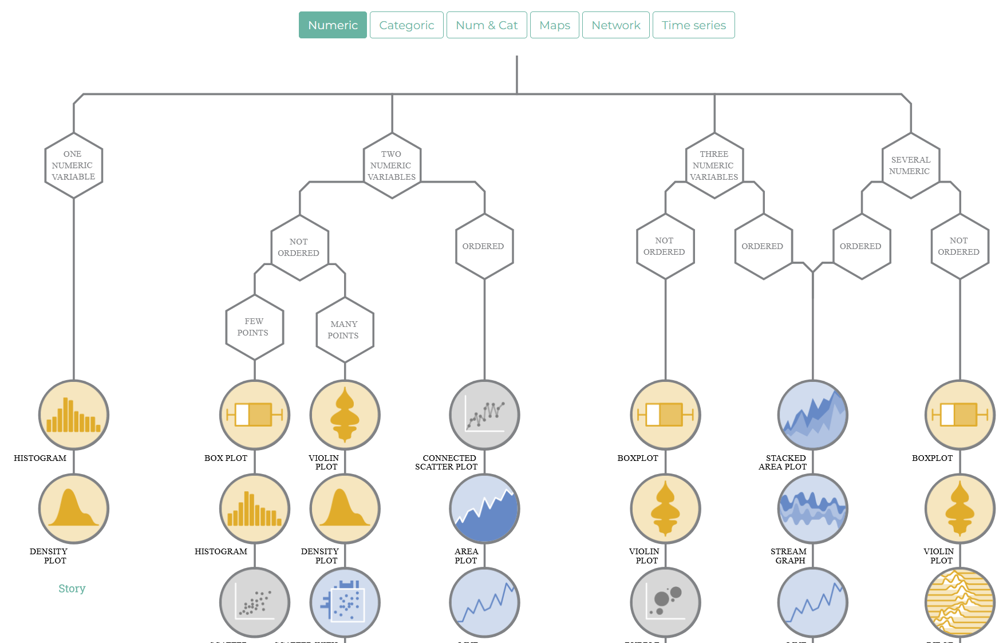

# Visualisierung mit `{ggplot2}`

```{r setup1, echo = F, include=FALSE}
if(Sys.getenv("USERNAME") == "filse" ) .libPaths("D:/R-library4")
if(Sys.getenv("USERNAME") == "filse" ) path <- "D:/oCloud/RFS/"
library(tidyverse)
library(patchwork)
knitr::opts_chunk$set(message = F,warning = F,highlight = "#<<",
                      out.height= "65%", out.width = "65%", fig.align="center")
# https://wtoivo.github.io/SGSSS-data-viz-workshop/bar-plots.html
etb18 <- haven::read_dta("./data/BIBBBAuA_2018_suf1.0.dta")
etb18$m1202[etb18$m1202<0] <- NA
tab_df <- xtabs(~S1+m1202, data = etb18) %>% data.frame()

etb18$zpalter[etb18$zpalter>100] <- NA
```


Neben Kennzahlen/Tabellen können/sollten Verteilungen auch visualisiert werden. 
Dafür bietet `{ggplot2}` eine riesige Auswahl an Möglichkeiten. 

Zunächst sehen wir uns den Weg zu einem Scatterplot an:

```{r, out.height= "80%", out.width= "80%", fig.align="center", echo = F}
#| warning: false
etb18 %>%
  slice(1:100) %>% 
  mutate(S1_fct = factor(S1, levels = 1:2, labels = c("Männer","Frauen"))) %>%
ggplot(aes(x = zpalter, y = az)) +
  geom_point(aes(color = S1_fct)) +
  facet_grid(~S1_fct) +
  theme_minimal() +
  labs(color = "Geschlecht", y = "Arbeitszeit/Woche",
       x = "Alter") +
  scale_color_manual(values = c("lightskyblue4","navy"))
```

## ggplot2 und die grammar of graphics 

`{ggplot2}` ist Teil des `{tidyverse}`, d.h. wir können entweder nur `{ggplot2}` oder die gesamte `{tidyverse}`-Sammlung laden:
```{r}
#| eval: false
library(ggplot2)
library(tidyverse)
```


Nach der Installation und der Aktivierung von `{ggplot2}` können wir uns der Logik dieses Pakets widmen. 
`ggplot2` ist die Umsetzung des Konzepts der "layered grammar of graphics" in R. Die Idee dieses Visualisierungssystems ist es, Datenvisualisierung in Parameter zu unterteilen: der zugrundeliegende Datensatz, die darzustellenden Variablen, die Wahl der darzustellenden Formen, das Koordinatensystem, Skalen und statistische Transformationen. Ein Standardbefehl in `ggplot2` sieht ungefähr so aus:

```{r,eval=F}
ggplot(data = datensatz, aes(x = var1, y = var2, color = var3)) +
  geom_point() +
  labs(title= "Titel", subtitle = "Untertitel") +
  theme_minimal()
```
Wir rufen also zunächst mit `ggplot()` eine Darstellung auf. In den weiteren Argumenten werden dann weitere Aspekte festgelegt:  

+ Mit `data = ` geben wir den `data.frame` an, den wir darstellen möchten
+ Die Aesthetics `aes()` legen fest, welche Variablen dargestellt werden sollen: hier also `var1` auf der x-Achse, `var2` auf der y-Achse und `var3` soll die Farbgebung festlegen
+ Die Layers `geom_..` geben die Art der Darstellung an, zB. `geom_point()` für Punkt- und `geom_bar()` für Säulendiagramme.
+ Mit `labs` können wir Beschriftungen angeben, zB. einen Titel vergeben oder die Achsenbeschriftungen anpassen
+ Die Themes `theme_...` legen das Design der Graphik fest, zB. schwarz/weiße Achsen- und Hintergrundfarben mit  `theme_bw()`

Wir arbeiten uns also jetzt durch die einzelnen *layer*/Schichten der Grafik:

### `data =`

`data = ` : Datengrundlage für unsere Graphik ist die ETB18 mit den Angaben zur Arbeitszeit sowie dem Geschlecht und Alter der Befragten:
```{r}
etb18 %>% select(az,S1,zpalter) %>% head()
```

Um die Grafik nicht zu groß zu machen, verwenden wir nur die ersten 100 Beobachtungen:
```{r}
etb18_small <- etb18 %>% slice(1:100)
```

Wir starten unseren ggplot also mit:
```{r,out.height= "40%"}
ggplot(data = etb18_small)
```


### `aes` 

Diese Werte wollen wir also in einem Scatterplot darstellen, sodass das Alter auf der x-Achse und auf der y-Achse die Wochenarbeitszeit  abgetragen ist:
```{r, eval=F}
#| warning: false
ggplot(data = etb18_small, aes(x = zpalter, y = az))
```
```{r, fig.align="center", echo=F, warning=F, message=F}
ggplot(data = etb18_small, aes(x = zpalter, y = az)) + theme_gray(base_size = 8) + theme(aspect.ratio = 1)
```
### `geom`
Wenn wir nur diese Angaben machen, bekommen wir lediglich ein leeres Koordinatensystem - warum? Weil wir noch nicht angegeben haben, welche *Form* der Darstellung wir gerne möchten. Dazu muss wir ein `geom_` angeben, für Säulendiagramme ist das `geom_col()`, diese hängen wir an den `ggplot`-Befehl mit `+` an:
```{r}
ggplot(data = etb18_small, aes(x = zpalter, y = az)) + geom_point()
```
Mit `color =`
```{r}
ggplot(data = etb18_small, aes(x = zpalter, y = az)) + geom_point(color = "orange")
```

Das sieht soweit schon ganz gut aus, allerdings werden die Punkte noch nicht getrennt nach Geschlecht dargestellt. 
Dazu müssen wir die Geschlechtsangabe (`S1`) in `aes()` angeben. 
Das Geschlecht soll die Färbung der Punkte vorgeben, diese können wir in `aes` mit `color` angeben:
```{r,error=TRUE}
ggplot(data = etb18_small, aes(x = zpalter, y = az, color = S1 )) + 
  geom_point()
ggplot(data = etb18_small, aes(x = zpalter, y = az, color = as.numeric(S1))) + 
  geom_point()
ggplot(data = etb18_small, aes(x = zpalter, y = az, color = factor(S1))) + 
  geom_point()
```

Außerdem können wir mit `scale_fill_manual`[^2] selbst Farben angeben, eine Liste möglicher Farben findet sich [**hier**](http://www.stat.columbia.edu/~tzheng/files/Rcolor.pdf).

[^2]: Hätten wir `color` in `aes`  angeben, wäre der entsprechende Befehl `scale_color_manual`.
```{r}
ggplot(data = etb18_small, aes(x = zpalter, y = az, color = factor(S1))) + 
  geom_point() + 
  scale_color_manual(values = c("lightskyblue4","navy"))
```

### Beschriftungen: Legende anpassen

Wir können mit den Optionen `breaks` und `labels` zudem auch die Beschriftung der Legende bearbeiten. Dazu geben wir zunächst in `breaks`  die Ausprägungen der Variable Geschlecht an und dann in der gleichen Reihenfolge die zu vergebenden Labels:
```{r, out.height= "75%", out.width = "75%", fig.align="center"}
ggplot(data = etb18_small, aes(x = zpalter, y = az, color = factor(S1))) + 
  geom_point() + 
  scale_color_manual(values = c("lightskyblue4","navy"),
                    breaks = c(1,2), labels = c("Männer", "Frauen") )
```
### Beschriftungen: Titel

Abschließend passen wir dann noch mit `labs` die Beschriftungen an, dabei haben wir folgende Optionen:

+ `title`: Überschrift für die Graphik
+ `subtitle`:  Unterzeile zur Überschrift
+ `caption`: Anmerkung unterhalb der Graphik
+ `x`: x-Achsenbeschriftung
+ `y`: y-Achsenbeschriftung
+ `fill`: Beschriftung für die Legende, wenn `fill` in `aes()` angegeben wurde
+ `color`: Beschriftung für die Legende, wenn `color` in `aes()` angegeben wurde

Außerdem können wir mit `theme_` ein anderes Design auswählen, zB. mit `theme_minimal()` einen weißen Hintergrund mit grauen Markierungslinien (weitere Beispiele in den Hinweisen unter [Themes](#themes))
```{r}
ggplot(data = etb18_small, aes(x = zpalter, y = az, color = factor(S1))) + 
  geom_point() + 
  scale_color_manual(values = c("lightskyblue4","navy"),
                    breaks = c(1,2), labels = c("Männer", "Frauen") ) +
  theme_minimal() +
  labs(color = "Geschlecht", y = "Arbeitszeit/Woche",
       x = "Alter",
       title = "Arbeitszeit und Alter",
       subtitle = "Nach Geschlecht",
       caption = "Quelle: ETB 2018"
       ) 
```


## Aesthetics

```{r}
#| fig-asp: 0.35
#| echo: false
#| warning: false
#| message: false
eg <- tribble(
  ~x, ~y, ~size, ~x1,
  "A", 1, 5, 1,
  "B", 1, 10, 2,
  "C", 1, 15, 3
)

eg_theme <- 
  theme(axis.text.y = element_blank(),
        axis.ticks = element_blank(), 
        # aspect.ratio = .5,
        plot.title = element_text(size = rel(1.5),hjust = 0.5))

aes_clr <- 
  ggplot(eg, aes(x = x, y = y, color = x)) +
    geom_point(size = 5) +
    guides(color = FALSE) +
    labs(title = "Color (discrete)") +
    eg_theme   

aes_clrc <- 
  ggplot(eg, aes(x = x1, y = y, color = x1)) +
    geom_point(size = 5) +
    guides(color = FALSE) +
    coord_cartesian(xlim = c(1, 3.5)) +
    labs(title=  "Color (continuous)") +
    eg_theme

aes_size <- 
  ggplot(eg, aes(x = x, y = y, size = x)) +
    geom_point() +
    scale_size_discrete(range = c(1.5, 10)) +
    guides(size = FALSE) +
    labs(title = "Size") +
    eg_theme 
  
aes_fill <-   
  ggplot(eg, aes(x = x, y = y, fill = x)) +
    geom_point(size = 5, pch = 21, stroke = 1.5) +
    guides(fill = FALSE) +
    eg_theme+ 
  labs(title = "fill")

aes_shape <- 
  ggplot(eg, aes(x = x, y = y, shape = x)) +
    geom_point(size = 5) +
    guides(shape = FALSE) +
    eg_theme + 
    labs(title = "shape")
# Alpha

aes_alpha <- 
  ggplot(eg, aes(x = x, y = y, alpha = x)) +
    geom_point(size = 5) +
    guides(alpha = FALSE) +
    eg_theme +
  labs(title="alpha")


aes_clr + aes_size + aes_shape
aes_clrc + aes_fill + aes_alpha
```


```{r}
#| out-height: 100%
#| out-width: 100%
ggplot(data = etb18_small, aes(x = zpalter, y = az, 
                               color = factor(S1),
                               fill = factor(S1),
                               shape = factor(m1202))) + 
  geom_point() + 
  scale_fill_manual(values = c("lightskyblue4","navy"),
                    breaks = c(1,2), labels = c("Männer", "Frauen") ) +
  scale_color_manual(values = c("green","orange"),
                    breaks = c(1,2), labels = c("Männer", "Frauen") ) +
  scale_shape_manual(values = c(21:24),breaks = c(1:4), 
                     labels = c("ohne Aus", "duale Ausb.","Aufstiegsfortb.","FH/Uni")) +
  theme_minimal() +
  labs(color = "Geschlecht", 
       shape = "Ausbildung",
       fill = "Geschlecht",
       y = "Arbeitszeit/Woche",
       x = "Alter",
       title = "Arbeitszeit und Alter",
       subtitle = "Nach Geschlecht",
       caption = "Quelle: ETB 2018"
       ) 
```
### Shapes
```{r}
#| echo: false
#| out-height: 50%
#| out-width: 50%
#| fig-align: "center"
shp_df <- data.frame(shp = factor(1:25), x = rep(1:5,each=5), y = rep(1:5,5))
ggplot(shp_df,aes(x,y)) +
  geom_point(shape=shp_df$shp, size = 7, fill = "dodgerblue") +
  geom_text(aes(label=shp,x = x-.2), size = 6) +
  theme_void(base_size=15)+
  scale_y_reverse() +
  theme(plot.margin = unit(c(2,2,2,2),"lines"))
```


### Linetypes
```{r}
#| echo: false
#| out-height: 30%
#| out-width: 50%
#| fig-align: "center"
lt_df <- data.frame(x = 0, y = seq(0,.75,.125),
                    lty = 0:6,
                     lt = c("0 'blank'"   ,"1 'solid'"   ,"2 'dashed'"  ,"3 'dotted'"  ,"4 'dotdash'" ,"5 'longdash'",  "6 'twodash'" )  )
ggplot(lt_df, aes(x,y,linetype = factor(lty))) + 
  geom_segment(aes(xend = 1,yend = y), size = 1) +
  geom_text(aes(x=-.35,label = lt),hjust= 0, size = 6) +
  theme_void(base_size=12)+
  guides(linetype = F) +
  scale_y_reverse()

```

Übersicht zu Shapes und Linetypes im [R Cookbook](http://www.cookbook-r.com/Graphs/Shapes_and_line_types/)

## Verteilungen visualisieren: Boxplots, Histogramme

Definition der Bestandteile eines Boxplots: 

+ ggf. Ausreißer
+ unterer Whisker: `q1 - 1.5* IQR`
+ untere Grenze: 1. Quartil 
+ mittlere Linie: Median 
+ obere Grenze: 3. Quartil 
+ oberer Whisker: `q3 + 1.5* IQR`
+ ggf. Ausreißer

Die Box enthält also die zentralen 50% des Wertebereichs.
```{r, sw05_boxplot1, echo = F, out.height="45%", out.width="50%", fig.align="center", warning=F,message=F}
ak <- readr::read_delim(paste0(path,"allbus_kumuliert.csv"), delim = ";", col_types = cols(.default = col_double()))

bp_ann_df <- 
  filter(ak,hs16>0) %>% 
  mutate_at(vars(hs16),~ifelse(.<0,NA,.)) %>% 
  summarise(q25 = quantile(hs16,probs = .25),
            q50 = quantile(hs16,probs = .5),
            q75 = quantile(hs16,probs = .75),
            whis1 = q25 - 1.5*(q75-q25) + .5 ,
            whis2 = q75 + 1.5*(q75-q25) - .5) %>% 
  mutate_all(~if_else(. < 0,0,.)) %>% 
  pivot_longer(cols=everything(), values_to = "hs16") %>% 
  mutate(xend1 = ifelse(grepl("whis",name),.015,.4),
         name = case_when(name == "q25" ~ "1. Quartil (25% Grenze)",
                          name == "q50" ~ "Median (50% Grenze)",
                          name == "q75" ~ "3. Quartil (75% Grenze)",
                          name == "whis1" ~ "unterer Whisker",
                          name == "whis2" ~ "oberer Whisker"),
         x = 1)

bp_ann_ausr <- filter(ak,!between(hs16,146,197),hs16>0) %>% select(hs16) %>% mutate(name="Ausreißer",x=1) %>% 
  distinct() %>% group_by(aus=hs16>146) %>% 
  mutate(hs16m=mean(hs16) %>% if_else(.<144,140,.))

  
ggplot(filter(ak,hs16>0), aes(x = 0, y = hs16)) + 
  geom_boxplot() + 
  geom_label(data = bp_ann_df, aes(x = x-.45, y = hs16, label = name), hjust = 0, label.size = .0,fontface="italic", size = 5.25) +
  geom_label(data = bp_ann_ausr, aes(x = x-.45, y = hs16m, label = name), hjust = 0, label.size = .0,fontface="italic", size = 5.25) +
  geom_segment(data = bp_ann_df, aes(x = x-.451, xend = xend1, yend = hs16, y = hs16), color = "#172869",
               lineend = 'butt', linejoin ='bevel',arrow = arrow(length = unit(.025,"npc"), type = "closed")) +
  geom_segment(data = bp_ann_ausr, aes(x = x-.451, xend = .015, yend = hs16, y = hs16m), color = "#172869",
               lineend = 'butt', linejoin ='bevel',arrow = arrow(length = unit(.01,"npc"), type = "closed")) +
  labs(color = "", # legenden-label auf leer
       y = "", # y-Achse labeln
       x="")+ # x-Achse labeln
  theme_void() + 
  theme(axis.text.x = element_blank()) +
  expand_limits(x = c(0,1.1))

```

Mit der folgenden Syntax können wir mit `ggplot2` einen Boxplot erstellen. Da wir nur eine Variable betrachten, müssen wir lediglich `y = ` oder `x =` angeben - je nachdem ob die Box vertikal oder horizontal orientiert sein soll.
```{r, eval = F}
library(ggplot2)
ggplot(data = etb18, aes(y = az)) + geom_boxplot()
```

So können wir einen Boxplot erstellen, der die Werte für Männer und Frauen getrennt darstellt: 
```{r, eval = F}
ggplot(data = etb18, aes(y = az)) + geom_boxplot() + 
  facet_wrap(~S1) + # nach geschlecht aufsplitten
  theme_minimal()
```
Oben sehen wir die Ausprägungen von `S1`: (1 & 2). Da durch die Ausreißer die Box sehr klein ist, rechts ein Zoom auf den Bereich von 0-20.000€ Monatseinkommen (Syntax unter [**Hinweise**](#bp_hinweise))
```{r sw05_boxplot, echo = F, out.height="80%", out.width="80%", fig.align="center", warning=F,message=F}
library(ggplot2)
library(patchwork)

box_plot <- 
  ggplot( etb18, aes(y = az, x = as.character(S1))) + 
  geom_boxplot(aes(color = as.character(S1))) + 
  # facet_wrap(~S1) +
  theme_minimal() +
  labs(color = "",
       y = "Arbeitszeit",
       x="")+
  scale_color_manual(values = c("#8F92A1","#172869"),
                     breaks = c("1","2"),
                     labels = c("M", "F"), guide = F) 

box_zoom <- box_plot +
  coord_cartesian(ylim = c(25,50)) 

box_plot + box_zoom
```
Befragte aus den neuen Bundesländern geben niedrigere Einkommen an: der Median sowie beide Quartilsgrenzen liegen im Osten niedriger als im Westen. 

```{r}
ggplot(data = etb18, aes(x = az, fill = as.character(S1))) + 
  geom_histogram() + 
  facet_wrap(~S1) + # nach geschlecht aufsplitten
  theme_minimal()
```
```{r}
ggplot(data = etb18, aes(x = az)) + 
  geom_histogram(aes(fill = factor(S1)), alpha = .5, color = "grey50") + 
  theme_minimal()

ggplot(data = etb18, aes(x = az)) + 
  geom_histogram(aes(fill = factor(S1)), color = "grey50",position = position_dodge()) + 
  scale_fill_viridis_d(option = "E",labels = c("Männer","Frauen")) +
  theme_minimal()

ggplot(data = etb18, aes(x = az)) + 
  geom_density(aes(fill = factor(S1)), alpha = .5) + 
  scale_fill_viridis_d(option = "E",labels = c("Männer","Frauen")) +
  labs(fill = "") +
  theme_minimal()
```

## Kategoriale Merkmale 
Im Folgenden sehen wir uns eine Möglichkeit an, die gerade erstellte Kontingenztabelle zu visualisieren:
```{r}
etb18 %>% count(S1,m1202) %>% filter(!is.na(m1202))

ggplot(data = etb18 , 
       aes(x = m1202, fill = factor(S1) )) + 
  geom_bar(  position=position_dodge()) + 
  theme_minimal() + 
  scale_fill_manual(values = c("navajowhite","navy"),
                    breaks = c(1,2), labels = c("Männer", "Frauen")) +
  scale_x_continuous(breaks = 1:4 , labels = c("ohne Ausb.", "duale Ausb.","Aufstiegsfortb.","FH/Uni")) +
  labs(title = "Ausbildungsabschlüsse nach Geschlecht",
       subtitle = "Absolute Häufigkeiten",
       caption = "Quelle: ETB 2018",
       x = "Ausbildung",
       y = "Absolute Häufigkeit",
       fill = "Geschlecht" ) 


ggplot(data = etb18 , 
       aes(x = m1202, fill = factor(S1),
           y = ..count../sum(..count..)
           )) + 
  geom_bar(  position=position_dodge()) + 
  theme_minimal() + 
  scale_fill_manual(values = c("navajowhite","navy"),
                    breaks = c(1,2), labels = c("Männer", "Frauen")) +
  scale_x_continuous(breaks = 1:4 , labels = c("ohne Ausb.", "duale Ausb.","Aufstiegsfortb.","FH/Uni")) +
  scale_y_continuous(labels = scales::label_percent(accuracy = 1)) +
  labs(title = "Ausbildungsabschlüsse nach Geschlecht",
       subtitle = "Relative Häufigkeiten",
       caption = "Quelle: ETB 2018",
       x = "Ausbildung",
       y = "Relative Häufigkeit",
       fill = "Geschlecht" ) 

```

## Aufgaben

(@) Laden Sie den Allbusdatensatz mit dem csv-Import in R.
(@) Erstellen Sie eine Kontingenztabelle für `sex` und `educ`. Welche Merkmalskombination ist die häufigste? Denken Sie daran, fehlende Werte mit `NA` auszuschließen.
(@) Erstellen Sie die Kontingenztabelle mit relativen Häufigkeiten.
(@) Erstellen Sie die Varianten der Kontingenztabelle mit relativen Häufigkeiten als Zeilen- und Spaltenprozente. 
+ Welcher Anteil der Befragten mit Fachhochschulreife ist männlich?
+ Wie hoch ist der Anteil der Frauen an Befragten mit Hauptschulabschluss?
+ Welcher Anteil der Frauen hat Abitur?
+ Wie hoch ist der Anteil der Realschulabsolventen an allen befragten Männern?

(@) Erstellen Sie eine Säulengraphik auf Basis der absoluten Häufigkeitsverteilung der Bildung nach Geschlecht! 
+ Ändern Sie die Darstellung in ein Punktdiagramm. 

(@) Erstellen Sie eine Kontingenztabelle für `sex` und `gkpol`. Welche Merkmalskombination ist die häufigste? Denken Sie daran, fehlende Werte mit  `NA` auszuschließen.
(@) Erstellen Sie die Kontingenztabelle mit relativen Häufigkeiten.
(@) Erstellen Sie die Varianten der Kontingenztabelle mit relativen Häufigkeiten als Zeilen- und Spaltenprozente. 
+ Welcher Anteil der Befragten aus Städten mit über 500.000 Einwohnern ist weiblich?
+ Wie hoch ist der Anteil der Männer an Befragten, die in Orten mit unter 2.000 Einwohnern leben?
+ Welcher Anteil der Frauen lebt in Städten mit 50.000 bis 99.999 Einwohnern?
+ Wie hoch ist der Anteil der Bewohner von Städten mit 20.000 bis 49.999 Einwohnern an allen befragten Männern?

## Profi-Aufgaben

(@) Erstellen Sie eine Säulengraphik auf Basis der absoluten Häufigkeitsverteilung der Wohnortgrößen nach Geschlecht! Analog zur Darstellung aus dem Beispiel soll das Geschlecht durch unterschiedliche Farben gekennzeichnet werden.
+ Verändern Sie die Farben der Balken mit Hilfe von `scale_fill_manual` (Siehe Abschnitte [Farben](#farben) und [ColorBreweR](#brewer) unter "weitere Optionen")
+ Ändern Sie die Darstellung in eine Punktegraphik oder fügen sie mit `geom_line()` eine Linie ein. Für `geom_line()` ist zusätzliche die Gruppierung für die zu verbindenden Punkte anzugeben (`aes(......, group = sex)`)
+ Sie können mit `size = 2` die Göße und mit `shape = ` auch die Formen der Punkte verändern, siehe [hier](http://www.cookbook-r.com/Graphs/Shapes_and_line_types/)


## Aufgaben zu Verteilungen

(@) Erstellen Sie jeweils einen Boxplot für das HH-Einkommen für 1994 und 2010! 
  + Welche Kennzahlen können Sie jeweils aus den horizontalen Linien ablesen?
  + Was können Sie jeweils zu den HH-Einkommensverteilungen sagen?
  + Durch Anhängen des Arguments `+  coord_cartesian(ylim = c(min,max))` können Sie "zoomen" indem Sie statt `min` und `max` die Limits einsetzen.

(@) Erstellen Sie jeweils einen Boxplot für Ost und West!


Erstellen Sie die Boxplots nach Ost-West für 1994 und 2010 Jahre in einer Grafik!
+ Erstellen Sie zunächst einen Datensatz, welcher nur Beobachtungen aus 1994 und 2010 enthält und legen diesen als `a9410` ab. Nutzen Sie dazu `|` für eine "Oder"-Auswahl:
```{r, eval = F}
a9410 <- ak[ak$year == jahr1 | ak$year == jahr2,]
```
+ Denken Sie daran, auch in `a9410` die Missings für `di05` mit `NA` zu überschreiben (siehe oben)!  

Indem wir zu `facet_wrap` neben `eastwest` auch `year` angeben, wird eine 4-teilige Grafik erstellt mit jeweils einem Boxplot für jedes Jahr und Ost/West. Mit `nrow = 1` können wir  die Boxplots in eine Reihe setzen:

```{r, eval = F}
ggplot(data = ..., aes(...) )+ 
  geom_boxplot() +
  facet_wrap(~year+eastwest, nrow = 1) + ...
```

Was können Sie bei den Unterschieden zwischen Ost und West im Zeitverlauf erkennen? Denken Sie auch hier wieder an die Möglichkeit, mit ` coord_cartesian(ylim = c(0,20000))` zu zoomen. 

+ Vergeben Sie unterschiedliche Farben für Ost und West (siehe Hinweise)

# Hinweise {#bp_hinweise}
Vollständige Syntax für farbigen Boxplot
```{r, eval = F}
library(ggplot2)
ggplot(a14, aes(x = "", y = di05)) + 
  geom_boxplot(aes(color = as.character(eastwest))) + 
  facet_wrap(~eastwest) +
  theme_minimal() +
  labs(color = "",
       y = "HH- Einkommen",
       x="")+
  scale_color_manual(values = c("lightblue3","navy"),
                     breaks = c(1,2),
                     labels = c("west", "ost")) 
```


## Weitere Optionen für ggplot2 
### Farben {#farben}
Neben den im Beispiel verwendeten Farben für `fill` können natürlich auch noch unzählige weitere Farben in `scale_fill_manual` verwendet werden. *[Hier](http://www.stat.columbia.edu/~tzheng/files/Rcolor.pdf)* findet sich eine Übersicht. 

```{r, out.height= "40%", out.width= "40%", fig.align="center"}
ggplot(data = tab_df, aes(x = m1202, y = Freq, fill = S1)) + 
  geom_col(position=position_dodge()) +
  scale_fill_manual(values = c("dodgerblue4","sienna1"),
                    breaks = c(1,2), labels = c("Männer", "Frauen") ) +
  labs(title = "Familienstand",subtitle = "Absolute Häufigkeiten pro Geschlecht",
       caption = "Quelle: Allbus 2016",x = "Familienstand",
       y = "Absolute Häufigkeit",fill = "Geschlecht" ) + theme_minimal()
```

### ColorBreweR {#brewer}

Alternativ zur manuellen Auswahl der Farben mit `scale_fill_manual` können mit `scale_fill_brewer()` auch vorgegebene Farbpaletten des *colorbrewer* verwendet werden. Dazu muss lediglich `scale_fill_brewer()` anstelle von `scale_fill_manual` angeben werden und statt `values` eine der Paletten - eine Übersicht findet sich hier: <http://colorbrewer2.org/>

```{r, out.height= "50%", out.width= "50%", fig.align="center"}
ggplot(data = tab_df, aes(x = m1202, y = Freq, fill = S1)) +
  geom_col(position=position_dodge()) +
  scale_fill_brewer(palette = "YlGnBu",
                    breaks = c(1,2), labels = c("Männer", "Frauen") ) +
  labs(title = "Familienstand",subtitle = "Absolute Häufigkeiten pro Geschlecht",
       caption = "Quelle: Allbus 2016", x = "Familienstand",
       y = "Absolute Häufigkeit",fill = "Geschlecht" ) + theme_minimal()
```


MetBrewer
DutchMasters
scico


### Weitere themes {#themes}
Neben `theme_minimal()` gibt es noch weitere Designs: eine Liste findet sich [hier](https://ggplot2.tidyverse.org/reference/ggtheme.html). Hier ein Beispiel mit `theme_dark()`:

```{r,  out.height= "40%", out.width= "40%", fig.align="center"}
ggplot(data = tab_df, aes(x = m1202, y = Freq, fill = S1)) + 
  geom_col(position=position_dodge()) +
  scale_fill_manual(values = c("navajowhite","navy"),
                    breaks = c(1,2), labels = c("Männer", "Frauen") ) +
  labs(title = "Familienstand",subtitle = "Absolute Häufigkeiten pro Geschlecht",
       caption = "Quelle: Allbus 2016",x = "Familienstand",
       y = "Absolute Häufigkeit",fill = "Geschlecht" ) + 
  theme_dark()
```
Es muss also lediglich das letzte Argument (`theme_..`) angepasst werden. Weitere Themes sind zB: `theme_light()`, `theme_classic()`, `theme_void()` oder `theme_bw()`


## Linksammlung

+ Schriftgröße und -farbe anpassen: [Hier](https://cmdlinetips.com/2021/05/tips-to-customize-text-color-font-size-in-ggplot2-with-element_text/) findet sich eine gute Übersicht, wie die Schriftgröße und -farbe in `{ggplot2}` angepasst werden kann.

+ Das [Graph Kapitel des R Cookbooks](www.cookbook-r.com/Graphs/) ist eine hervorragende Quelle für alle möglichen Optionen und eine grundlegende Übersicht - bspw. zur Anpassung der [Legende](http://www.cookbook-r.com/Graphs/Legends_(ggplot2)), [Linien- und Punktvarianten](http://www.cookbook-r.com/Graphs/Shapes_and_line_types) oder den [Achsen](http://www.cookbook-r.com/Graphs/Axes_(ggplot2))

+ [From Data to Viz ](https://www.data-to-viz.com/#explore) bietet einen Entscheidungsbaum für verschiedene Zusammenhänge und Deskriptionen mit Beispiel-Syntax


```{r,echo=FALSE}
#| out-width: 80%
#| out-height: 80%

```

+ Die [R Graph Gallery](https://r-graph-gallery.com/) ist noch etwas umfangreicher und bietet noch weitere Visualisierungsideen

+ Für alle, die mehr zu gelungenen (und schönen) Datenvisualisierungen mit `{ggplot2}` erfahren möchten, ist das [Tutorial von Cédric Scherer](https://cedricscherer.netlify.app/2019/08/05/a-ggplot2-tutorial-for-beautiful-plotting-in-r/) ein hervorragender Einstieg.

+ [Dieser Workshop](https://rstudio-conf-2022.github.io/ggplot2-graphic-design/) bietet weitere Einblicke wie Datenvisualisierungen mit `{ggplot2}` schöner gestaltet werden können.

+ [Eine Liste von Erweiterungen für ggplot2](https://albert-rapp.de/posts/ggplot2-tips/12_a_few_gg_packages/12_a_few_gg_packages.html)

+ [Lerntipps für Datenvisualisierungen](https://twitter.com/rappa753/status/1558787021891465217?s=11&t=iNPI1mKWQMSu6BCDKgNZWg)
