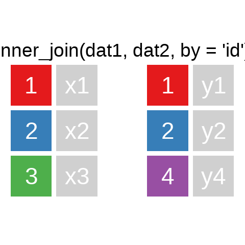
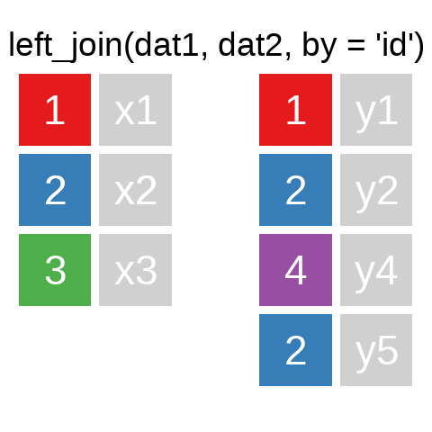
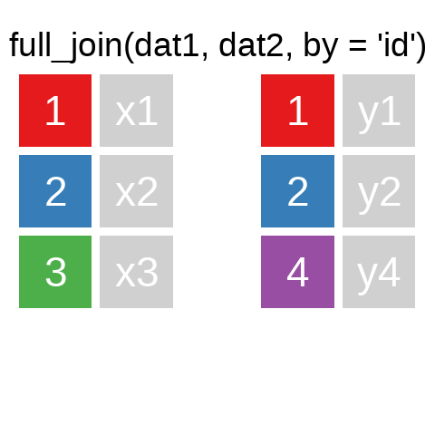

# Data Wrangling III {#wrang3}

```{r setup}
#| include: false
#| cache: false
if(Sys.getenv("USERNAME") == "filse" ) .libPaths("D:/R-library4") 
# library(extrafont)
# font_import(pattern = "Roboto",prompt = F)
# fonts()
knitr::opts_chunk$set(
  collapse = F,
  comment = "#>",
  echo = T,
  cache = T,
  warning = FALSE,
  message = FALSE
)
library(systemfonts)
# system_fonts() %>% filter(grepl("Roboto",name)) %>% select(family,1:3)

windowsFonts(mono=windowsFont("FiraMono"))
windowsFonts(Roboto=windowsFont("Roboto"))
```


## Datensätze verbinden

> A mutating join allows you to combine variables from two tables. It first matches observations by their keys, then copies across variables from one table to the other.  
[R for Data Science: Mutating joins](http://r4ds.had.co.nz/relational-data.html#mutating-joins)


Ein Überblick zu den wichtigsten Befehlen[^tdyref]

[^tdyref]: Illustrationen mit [tidyexplain](https://github.com/gadenbuie/tidyexplain)

```{r intial-dfs}
#| echo: false
#| out-width: "40%"
#| fig-align: "center"
source("./tidyexplain/00_base_join.R")
df_names <- tibble(
  .x = c(1.5, 4.5), .y = 0.25,
  value = c("dat1", "dat2"),
  size = 20,
  color = "black"
)

dat1 <- x
dat2 <- y


g <- plot_data(initial_join_dfs) +
  geom_text(data = df_names, family = "Roboto", size = 24) 
g
```

<!--  -->

```{r inner-join}
#| echo: false
source("tidyexplain/inner_join.R")
```
```{r left-join}
#| echo: false
# source("tidyexplain/left_join.R")
```
```{r left-join-extra}
#| echo: false
source("tidyexplain/left_join_extra.R")
```
```{r right-join}
#| echo: false
# source("tidyexplain/right_join.R")
```
```{r full-join}
#| echo: false
source("tidyexplain/full_join.R")
```


::: {layout-ncol=3}




 
:::

Es gibt natürlich auch [`right_join()`](https://dplyr.tidyverse.org/reference/mutate-joins.html)  oder [`anti_join()`](https://dplyr.tidyverse.org/reference/filter-joins.html). 
Für eine tiefergehende Einführung lohnt sich das Kapitel [Relational Data](https://r4ds.had.co.nz/relational-data.html#relational-data) aus [R for Data Science](https://r4ds.had.co.nz/).


Eine sehr hilfreiche Option in den `..._join()` ist die Verbindung unterschiedlicher Variablen.
Bspw. haben wir hier einige Fälle aus der ETB18 und 

```{r exmap}
#| code-fold: true
etb18_int_bl <- haven::read_dta("./data/BIBBBAuA_2018_suf1.0.dta",
                                col_select = c("intnr","Bula") # mit col_select() können Variablen ausgewählt werden
                                )

etb_ids <-  etb18_int_bl %>% slice(c(1,125,1230,21010,8722) )

alo_bula <- data.frame(bundesland = seq(1:11),
                       Werte = sample(letters,size = 11) # mit sample() kann eine zufällige Auswahl getroffen werden 
                       )
```


```{r join_by}
etb_ids
alo_bula
etb_ids %>% left_join(alo_bula,by = c("Bula"="bundesland"))
```

Ein sehr hilfreiche Checkmöglichkeit, die ich häufig verwende:
Für alle `Bula` in `etb_ids` findet sich eine Entsprechung in `alo$bundesland`:
```{r tabx_in}
table(etb_ids$Bula %in% alo_bula$bundesland)
```


### [Übung](#join_ue)


## Reshape: `pivot_longer()` & `pivot_wider()`

```{r}

```

## Übungen

### Übung 1 {#join_ue}


### Übung 2 {#pivot_ue}

