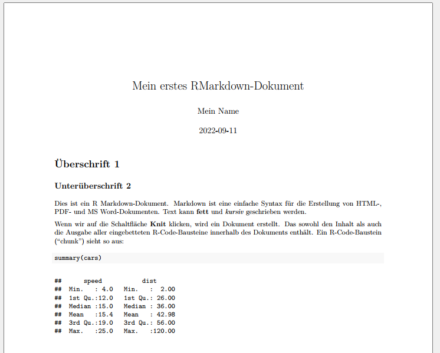

# RMarkdown

```{r setup, include=FALSE}
if(Sys.getenv("USERNAME") == "filse" ) .libPaths("D:/R-library4") 
knitr::opts_chunk$set(fig.align = "center")
```

[{R Markdown}](https://rmarkdown.rstudio.com/) erlaubt, formatierte Textelemente mit [Markdown](markdown.qmd) und R code bzw. Output zu kombinieren. 
Anders als ein R Script enthält ein RMarkdown-Dokument nicht nur Befehle, sondern auch Text - welcher mit Hilfe von [Markdown](markdown.qmd)-Befehlen formatiert werden kann.
So können Grafiken, Tabellen, usw. direkt und zeitgleich mit dem Begleittext erstellt werden.
Mit R Markdown können wir HTML, PDF, Word Dokumente, PowerPoint und HTML Präsentationen, Webseiten und Bücher erstellen.
Diese gesamte Webseite wurde mit [{R Markdown}](https://bookdown.org/yihui/rmarkdown-cookbook/) bzw. dem verwandten Paket [{Quarto}](quarto.org/) erstellt.

Dieses Kapitel kann lediglich eine kleine Einführung in RMarkdown sein.
Die [Hilfeseiten und Dokumentation für R Markdown](https://rmarkdown.rstudio.com/) ist extrem umfangreich und auch die [Tutorials](https://rmarkdown.rstudio.com/lesson-1.html) und [Cheatsheets](https://rmarkdown.rstudio.com/lesson-15.html) sind hervorragend.
Daher hier nur eine kleiner Überblick.

Ein RMarkdown-Dokument sieht in seiner Grundform ungefähr so aus:
 
````{verbatim, lang = "markdown"}
---
title: "Mein erstes RMarkdown-Dokument"
author: "Mein Name"
date: "2022-09-11"
output: pdf_document
---
  
# Überschrift 1

## Unterüberschrift 2

Dies ist ein R Markdown-Dokument. 
Markdown ist eine einfache Syntax für die Erstellung von HTML-, PDF- und MS Word-Dokumenten. 
Text kann **fett** und *kursiv* geschrieben werden. 

Wenn wir auf die Schaltfläche **Knit** klicken, wird ein Dokument erstellt.
Das sowohl den Inhalt als auch die Ausgabe aller eingebetteten R-Code-Bausteine innerhalb des Dokuments enthält. 
Ein R-Code-Baustein ("chunk") sieht so aus:

```{r cars}
# hier kommt der R Code hin
summary(mtcars$qsec)
```

````

```{r, out.width="50%", out.width="50%"}
#| echo: false


```


## Wichtige Begriffe

- **Chunk**: Abschnitt mit R-Code innerhalb eines RMarkdown-Dokuments.

````{verbatim, indent="    "}
```{r}
# hier kommt der R Code hin
```
````

Vor und nach dem Teilstück muss eine Leerzeile stehen. Die letzten drei Backticks müssen das Einzige sein, was in der Zeile steht. Wenn Sie weiteren Text hinzufügen, die Backticks vergessen oder sie versehentlich löschen, wird Ihr Dokument nicht korrekt in das Zielformat übersetzt.


- **Knit**: Beim  "knitten" eines RMarkdown Dokuments, werden zuerst alle chunks ausgeführt und der jeweilige Output in Markdown konvertiert. Im Anschluss ruft R [pandoc](https://pandoc.org/) auf um, den Markdown-Text in HTML, PDF oder Word zu konvertieren.

Knitten kann entweder über das "Knit"-Symbol oben im Editor mit der Tastenkombination `⌘⇧K` 
auf macOS
oder STRG + shift + k in Windows


```{r knit-button, echo=FALSE, out.width="30%"}
knitr::include_graphics("./pic/115_knit-button.png", error = FALSE)
```


## Chunks einfügen

Wir können neue chunks auf drei Arten erstellen

- Mit `⌘⌥I` auf macOS oder `STRG + alt + I` auf Windows-Rechnern.
Funktioniert auch, um einen existierenden chunck in zwei Teile zu teilen.

- Mit dem "Insert" Button oben im Editor:

```{r insert-chunk, echo=FALSE, out.width="30%"}
knitr::include_graphics("./pic/115_insert_chunk.png", error = FALSE)
```

- Selbest eintippen (besser nicht)


## Namen für chunks

Wir können den Abschnitten Namen hinzufügen, um die Navigation innerhalb des Dokument zu erleichtern. 
Wenn wir in RStudio auf das kleine Dropdown-Menü (mit dem `#`) am unteren Rand des Editors klicken, bekommen wir ein Inhaltsverzeichnis, das alle Überschriften und Abschnitte anzeigt. 
Wenn wir die Abschnitte benennen, werden sie in der Liste angezeigt. Wenn Sie keinen Namen angeben, wird der Chunk trotzdem angezeigt, aber Sie wissen nicht, was er tut.

```{r chunk-toc, echo=FALSE, out.width="40%"}
knitr::include_graphics("./pic/115_chunk-toc.png", error = FALSE)
```

Namen werden direkt nach dem  `{r` in der ersten Zeile des chunks angegeben. 
Leerzeichen sind in chunk-Namen nicht erlaubt, aber Unterstriche und Bindestriche. 
**Jeder chunk-Name darf innerhalb eines Dokuments nur einmal vergeben werden.**

````{verbatim}
```{r chunk_Name}
# R Code
```
````


## Chunk-Optionen

There are a bunch of different options you can set for each chunk. You can see a complete list in the [RMarkdown Reference Guide](https://rstudio.com/wp-content/uploads/2015/03/rmarkdown-reference.pdf) or at [**knitr**'s website](https://yihui.org/knitr/options/).

Options go inside the `{r}` section of the chunk:

````{verbatim}
```{r name-of-this-chunk, warning=FALSE, message=FALSE}
# Code goes here
```
````

Hier eine kleine Liste der wichtigsten Optionen:

- `fig.width=5` & `fig.height=4`: Größe von Plots
- `echo=FALSE`: Der chunk wird zwar ausgeführt und das Ergebnis im Zieldokument gezeigt, nicht aber der Code
- `include=FALSE`: Der chunk wird zwar ausgeführt, aber im Zieldokument werden weder der Code selbst noch das Ergebnis gezeigt
- `eval=FALSE`: Der chunk wird nicht ausgeführt, aber im Zieldokument gezeigt
- `message=FALSE`: messages werden ausgeblendet (bspw. alles was beim Laden von Paketen angezeigt wird)
- `warning=FALSE`: warnings werden ausgeblendet

You can also set chunk options by clicking on the little gear icon in the top right corner of any chunk:

```{r chunk-options, echo=FALSE, out.width="70%"}
# knitr::include_graphics("/files/img/reference/chunk-options.png", error = FALSE)
```

## Inline chunks

You can also include R output directly in your text, which is really helpful if you want to report numbers from your analysis. To do this, use `` `r "\u0060r r_code_here\u0060"` ``.

It's generally easiest to calculate numbers in a regular chunk beforehand and then use an inline chunk to display the value in your text. For instance, this document…

````{verbatim}
```{r find-avg-mpg, echo=FALSE}
avg_mpg <- mean(mtcars$mpg)
```
The average fuel efficiency for cars from 1974 was `r round(avg_mpg, 1)` miles per gallon.
````

… would knit into this:

> The average fuel efficiency for cars from 1974 was `r round(mean(mtcars$mpg), 1)` miles per gallon.

## Output

You can specify what kind of document you create when you knit in the [YAML front matter](/resource/markdown.qmd#front-matter). 

```yaml
title: "My document"
output:
  html_document: default
  pdf_document: default
  word_document: default
```

You can also click on the down arrow on the "Knit" button to choose the output *and* generate the appropriate YAML. If you click on the gear icon next to the "Knit" button and choose "Output options", you change settings for each specific output type, like default figure dimensions or whether or not a table of contents is included.

```{r output-options, echo=FALSE, out.width="35%"}
# knitr::include_graphics("/files/img/reference/output-options.png", error = FALSE)
```

The first output type listed under `output:` will be what is generated when you click on the "Knit" button or press the keyboard shortcut (`⌘⇧K` on macOS; `control + shift + K` on Windows). If you choose a different output with the "Knit" button menu, that output will be moved to the top of the `output` section.

The indentation of the YAML section matters, especially when you have settings nested under each output type. Here's what a typical `output` section might look like:

## `yaml`

Als yaml bezeichnet man die Kopfzeile der RMarkdown-Dokumente. Hier können wir allerhand Voreinstellungen festlegen. Unter anderem können wir auch Word-Dokument als Formatierungsvorlage angeben:

```yaml
---
title: "Mein Worddokument"
author: "My name"
date: "13. August 2022"
output: 
  word_document: 
    reference_docx: "Vorlage.docx"
    toc: yes
    fig_caption: yes
    fig_height: 4
    fig_width: 5
---
```
