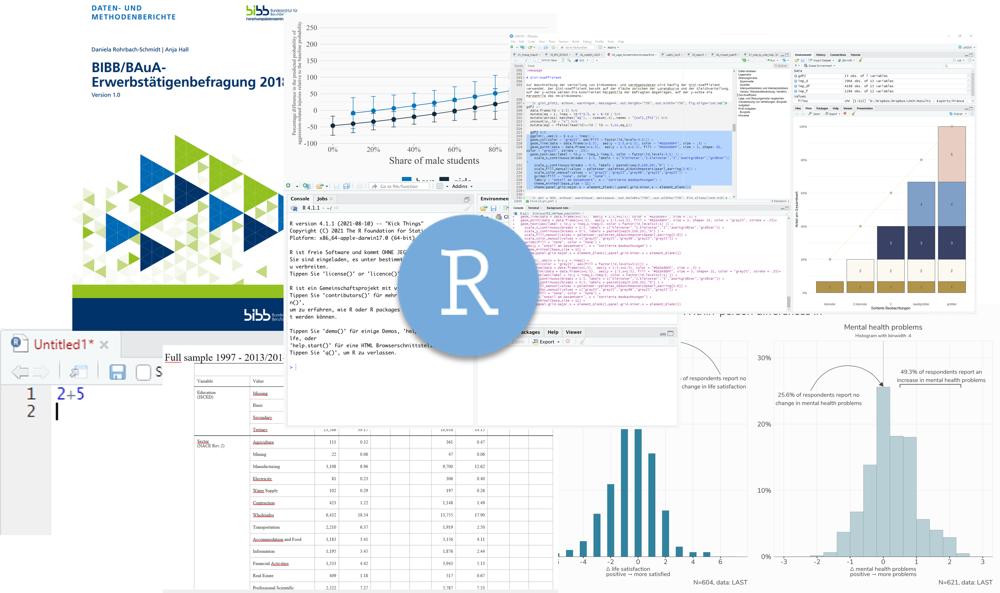

# Herzlich Willkommen {.unnumbered}

```{r indx, include=F}
if(Sys.getenv("USERNAME") == "filse" ) .libPaths("D:/R-library4") 
```

Hier entsteht das Begleitskript für die R-Kurse am BIBB 29.-30.09. und 06.-07.10.2022




Melden Sie sich gerne bei Fragen oder Wünschen unter andreas.filser[at]uol.de!

<!-- :::{.callout-note} -->
<!-- Note that there are five types of callouts, including:  -->
<!-- `note`, `tip`, `warning`, `caution`, and `important`. -->
<!-- ::: -->