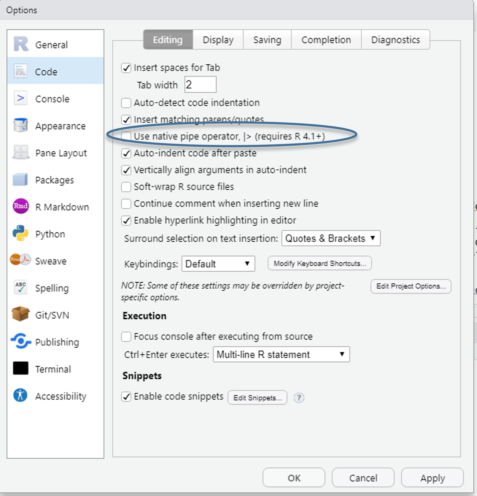

# Links & Weiterführendes {.unnumbered}

```{r ref01, include=F}
if(Sys.getenv("USERNAME") == "filse" ) .libPaths("D:/R-library4") 
library(tidyverse)
library(gt)
library(paletteer)
library(kableExtra)
```


## `%>%` vs. `|>`

In diesem Kurs haben wir die Pipe ` %>%` aus `{tidyverse}` (streng genommen aus dem Paket `{magrittr}`) kennen gelernt. Mit dem Update auf R 4.1 wurde in base R ebenfalls eine Pipe `|>` eingeführt und Hilfeseiten usw. ersetzen langsam, aber sicher `%>%` durch `|>`. 
Für (nahezu) alle Anwendungen, die wir kennengelernt haben, verhalten sich beide Pipes identisch - und nachdem am BIBB R die R-Version 4.0.5 zur Verfügung steht, haben wir uns an 'alte Variante' gehalten.
Letztlich spricht aber nichts dagegen, nach einem Update auf `|>` umzusteigen - oder einfach bei ` %>% ` zu bleiben.



Unter anderem steht [hier mehr zu den Unterschieden](https://r4ds.hadley.nz/workflow-pipes.html#vs) zwischen beiden Pipes.


## Einführungen in R

Eine Sammlung von Lehrskripten und Unterlagen aus verschiedenen Kontexten zum selbst weiter lernen: 

[R for Data Science](r4ds.had.co.nz/) *das* Standardwerk für Datenanalysen mit `{tidyverse}` - sehr intuitive Einführung, Fokus auf Data Science

[Problemorientiere Einführungen in spezifische Anwendungen "do more with R"](https://www.infoworld.com/article/3411819/do-more-with-r-video-tutorials.html)

[Ten simple rules for teaching yourself R](https://journals.plos.org/ploscompbiol/article?id=10.1371/journal.pcbi.1010372)

[Moderne Datenanalyse mit R](https://link.springer.com/book/10.1007/978-3-658-21587-3): Deutschsprachige Einführung in `{tidyverse}`


[Stata 2 R](https://stata2r.github.io/) richtet sich alle Anwender\*innen von Stata, die auf R umsteigen möchten. Allerdings wird hier anstelle des `{tidyverse}` das Paket `{data.table}` für die Datenaufbereitung gezeigt. `{data.table}` ist auf der einen Seite sehr schnell, jedoch von der Syntaxlogik her etwas umständlicher als das `{tidyverse}`. Für alle, die mit sehr großen Datensätzen arbeiten lohnt es sich aber, `{data.table}` auszuprobieren.

## Beispiele

[Paper zu einem Beispieldatensatz, komplett in R Markdown geschrieben](https://allisonhorst.github.io/penguins_paper_distill/rjarticle/penguins.html)
[Hier findet ihr den Source-Code](https://github.com/allisonhorst/penguins_paper_distill/blob/46342ebf450dfdb49741ae9f7059c6e3c266af70/rjarticle/penguins.Rmd)


## Cheatsheets

Eine Sammlung an Cheatsheets für eine breite Palette an Anwendungen gibt es [hier](https://www.rstudio.com/resources/cheatsheets/).

+ Datenvisualisierung mit [`{ggplot2}`](https://raw.githubusercontent.com/rstudio/cheatsheets/main/data-visualization.pdf)
+ Datensätze bearbeiten mit [`{dplyr}`](https://raw.githubusercontent.com/rstudio/cheatsheets/main/data-transformation.pdf)
+ Datensätze erstellen/reshapen mit [`{tidyr}`](https://raw.githubusercontent.com/rstudio/cheatsheets/main/tidyr.pdf)

## `{ggplot2}`

Eine große Stärke von `ggplot2` sind die zahlreichen Erweiterungen, welche beispielsweise ermöglichen

+ mehrere Grafiken zu kombinieren mit [`{patchwork}`](https://github.com/thomasp85/patchwork#patchwork)
+ Karten zu erstellen mit [sf](https://oliviergimenez.github.io/intro_spatialR/#1), weitere [Link](https://ourcodingclub.github.io/tutorials/dataviz-beautification-synthesis/)
+ fortgeschrittene Textformatierungen zu verwenden mit [`{ggtext}`](https://wilkelab.org/ggtext/)
+ Grafiken als Animation zu erstellen [`{gganimate}`](https://gganimate.com/) - [eine Einführung](https://goodekat.github.io/presentations/2019-isugg-gganimate-spooky/slides.html) oder [hier](https://rpubs.com/bradyrippon/929572)
+ Logos in in `{ggplot2}` einfügen mit [`{ggpath}`](https://mrcaseb.github.io/ggpath/)

Eine Übersicht zu Erweiterungspakteten für `{ggplot2}` findet sich [hier](https://exts.ggplot2.tidyverse.org/gallery/)

Auch [The R Graph Gallery](https://r-graph-gallery.com/) bietet eine hervorragende Übersicht zu Darstellungsmöglichkeiten mit Syntaxbeispielen für `{ggplot2}`.

+ [Tutorial von Cédric Scherer](https://cedricscherer.netlify.app/2019/08/05/a-ggplot2-tutorial-for-beautiful-plotting-in-r/)

+ [Session zu intuitiveren Grafiken von Cara Thompson](https://www.youtube.com/watch?v=_indbXPXUw8)

## regex

Für die Arbeit mit Textvariablen sind *regular expressions* (regex) eine große Hilfe. 
Damit lassen sich beispielsweise Textabschnitte nach bestimmten Zeichenfolgen durchsuchen, diese ersetzen usw.
Der [Blog von Joshua C. Fjelstul](https://jfjelstul.github.io/regular-expressions-tutorial/) ist ein guter Einstieg.
Darüber hinaus gibt es ein hilfreiches Cheatsheet zu [*regex* in R](https://raw.githubusercontent.com/rstudio/cheatsheets/main/regex.pdf) und das *regex* -Paket [`{stringr}`](https://raw.githubusercontent.com/rstudio/cheatsheets/main/strings.pdf)

## Weiteres 

[`{easystats}`](https://github.com/easystats/easystats#easystats-framework-for-easy-statistical-modeling-visualization-and-reporting) bietet eine Sammlung von Paketen, welche statische Auswertungen erleichtern und vereinheitlichen. Gleichzeitig geht diese Vereinheitlichung aber mit einer beschränkteren Flexibilität einher - das ist Geschmackssache und kommt auf den Anwendungsfall an. Wir haben aus dem `easystats`-Universum unter anderem [{performance}](https://easystats.github.io/performance/)  und [{effectsize}](https://easystats.github.io/effectsize/index.html) kennengelernt.

[Ereigniszeitmodelle / Event History Modellung / Survival Analysis](https://www.emilyzabor.com/tutorials/survival_analysis_in_r_tutorial.html)


::: {#refs}
:::
